<!-- =========================================================
     M.R.Ahamed — Interactive macOS Portfolio
     GitHub README
     ========================================================= -->

<div align="center">

<!-- macOS-style header -->

<table>
<tr>
<td>

🔴 &nbsp; 🟡 &nbsp; 🟢

</td>
</tr>
</table>

#  M.R.Ahamed

### 🖥️ Interactive macOS-Inspired Portfolio


<br>

**A portfolio that behaves like a desktop — not just another website.**

<br>

[](https://react.dev/)
[](https://www.typescriptlang.org/)
[](https://vite.dev/)


[](https://m-r-ahamed-portfolio.vercel.app/)
[](https://m-r-ahamed-portfolio.vercel.app/)

<br>

[](https://github.com/Ahamed369)
[](https://www.linkedin.com/in/mr-ahamed-6146a5276)
[](mailto:ahamedrock369@gmail.com)

<br>


</div>

---

# 🌐 Live Portfolio

<div align="center">


<br>

<a href="https://m-r-ahamed-portfolio.vercel.app/">
  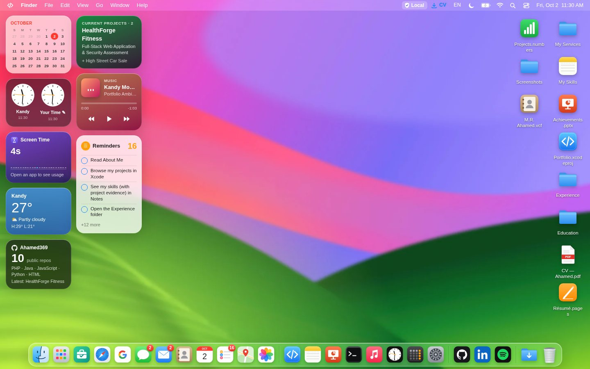
</a>

<br><br>

[](https://m-r-ahamed-portfolio.vercel.app/)
[](https://github.com/Ahamed369/M.R.Ahamed-Portfolio)
[](https://www.linkedin.com/in/mr-ahamed-6146a5276)

<br>

**Production:** Vercel &nbsp; • &nbsp; **Frontend:** React + TypeScript + Vite &nbsp; • &nbsp; **Experience:** Responsive + PWA

</div>

---

## 🍎 Welcome to My Digital Desktop

This project transforms a traditional developer portfolio into an interactive **macOS-inspired desktop experience**.

Rather than navigating through ordinary pages, visitors explore my work through a desktop environment containing applications, draggable windows, a Dock, Launchpad, Spotlight, Finder-style interfaces, Terminal, Control Center, Notification Center, widgets, games, media applications and system settings.

It brings together:

```text
Portfolio + Desktop UI + Software Engineering + Browser APIs + UI/UX
                              │
                              ▼
               An Interactive Digital Experience
```

The goal is simple:

> **Show my work through an experience that demonstrates the work itself.**

---

# 🖼️ Desktop Preview

<div align="center">

<a href="https://m-r-ahamed-portfolio.vercel.app/">

</a>

<br><br>

### ✨ Explore • Launch • Interact • Discover

[](https://m-r-ahamed-portfolio.vercel.app/)

</div>

---

# 🚀 Portfolio Highlights

<table>
<tr>
<td width="50%" valign="top">

### 🪟 Desktop Engine

- Custom window management
- Drag & resize
- Minimize & maximize
- Window focus / z-index
- Window tiling
- Mission Control
- Stage Manager
- App Switcher
- Genie / Scale effects

</td>

<td width="50%" valign="top">

### 🍎 macOS Experience

- Desktop environment
- Animated Dock
- Menu Bar
- Launchpad
- Spotlight
- Control Center
- Notification Center
- Lock Screen
- System Settings

</td>
</tr>

<tr>
<td width="50%" valign="top">

### 🧩 Application Ecosystem

- Portfolio applications
- Productivity tools
- Communication apps
- Media applications
- Utilities
- Developer tools
- Browser services
- Game Center

</td>

<td width="50%" valign="top">

### ⚡ Modern Web

- React 19
- TypeScript
- Vite
- Lazy loading
- Dynamic imports
- PWA capabilities
- Browser APIs
- Responsive design

</td>
</tr>
</table>

---

# 🧬 Portfolio DNA

<div align="center">

```text
╭──────────────────────────────────────────────────────────────╮
│                     M.R.AHAMED PORTFOLIO                     │
├──────────────────────────────────────────────────────────────┤
│                                                              │
│   💻 SOFTWARE ENGINEERING     ██████████████████████████      │
│   🎨 UI / UX                  ███████████████████████         │
│   🌐 FULL-STACK               █████████████████████████       │
│   📱 APPLICATIONS             ██████████████████████          │
│   🗄️ DATA & SYSTEMS          ████████████████████            │
│   🚀 ENTREPRENEURSHIP         █████████████████████           │
│                                                              │
╰──────────────────────────────────────────────────────────────╯
```

<sub>Visual overview of the portfolio's areas of focus — not a proficiency score.</sub>

</div>

---

# 🥧 Portfolio Ecosystem

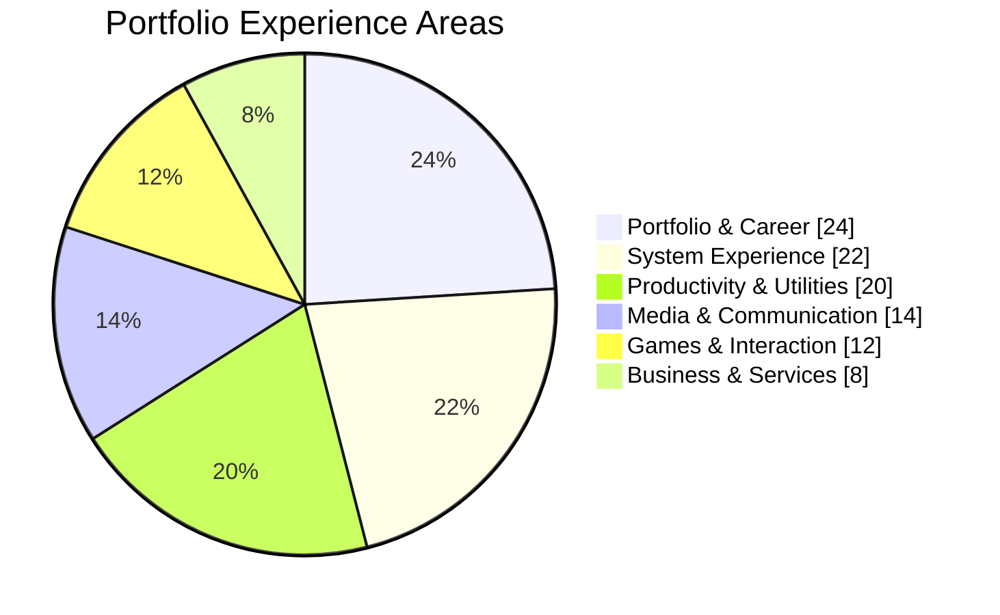

> The chart is a visual categorization of the portfolio experience, not measured usage analytics.

---

# 🏗️ System Architecture

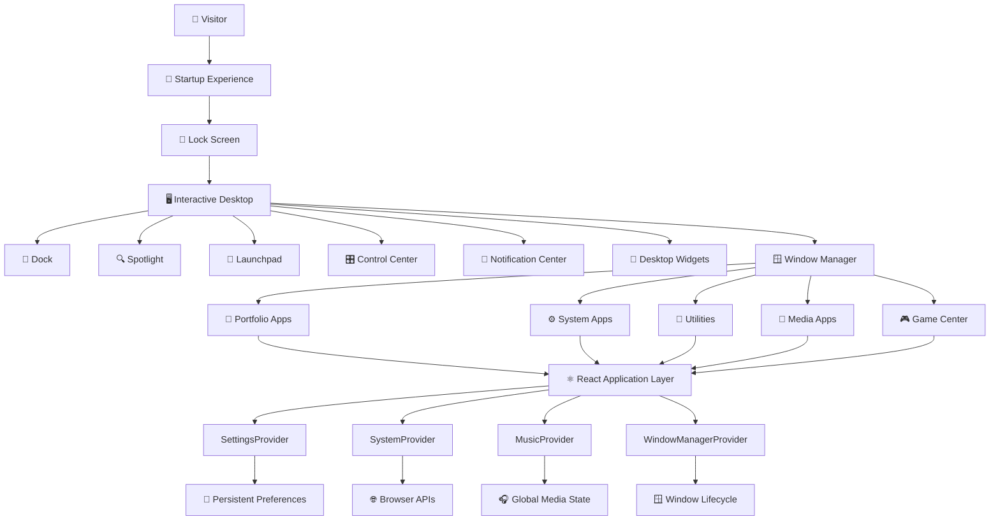

---

# 🔄 How the Portfolio Works

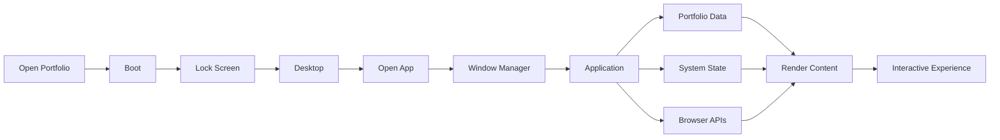

---

# 🪟 Window Management

The portfolio contains a custom desktop-style window management system.

### Supported interactions

```text
                    ┌───────────────────────┐
                    │      APP WINDOW       │
                    ├───────────────────────┤
                    │ 🔴   🟡   🟢          │
                    │                       │
                    │  Drag                 │
                    │  Resize               │
                    │  Focus                │
                    │  Minimize             │
                    │  Maximize             │
                    │  Restore              │
                    │  Tile                 │
                    │                       │
                    └───────────────────────┘
```

It supports:

- 🟢 Open
- 🔴 Close
- 🟡 Minimize
- 🔲 Maximize
- 🖱️ Drag
- ↔️ Resize
- 🎯 Focus
- 📚 Z-index management
- 🧲 Edge tiling
- 🪄 Genie / Scale minimization
- 🗂️ Stage Manager
- 🖥️ Mission Control
- ⌨️ Application switching

---

# 🚀 Dock Experience

<div align="center">

```text
╭─────────────────────────────────────────────────────────────╮
│  Finder  Safari  Xcode  Notes  Photos  Music  ⚙️  🗑️       │
╰─────────────────────────────────────────────────────────────╯
```

</div>

The Dock supports:

- Cursor-proximity magnification
- Smooth application animation
- Running indicators
- Minimized windows
- Recent applications
- Context menus
- Dock positioning
- Auto-hide
- Keep in Dock
- Remove from Dock
- Show in Finder
- Add to Desktop
- New Window
- Show All Windows

---

# 🔍 Spotlight

Search the portfolio from one central interface.

```text
⌘ + Space

╭──────────────────────────────────────────────╮
│ 🔍 Search M.R.Ahamed Portfolio...            │
├──────────────────────────────────────────────┤
│                                              │
│  💻 Projects                                 │
│  🧠 Skills                                   │
│  💼 Experience                               │
│  🎓 Education                                │
│  🛠️ Services                                │
│  📄 CV                                       │
│  🚀 Applications                             │
│                                              │
╰──────────────────────────────────────────────╯
```

Spotlight can surface portfolio information, applications and system actions.

---

# 🚀 Launchpad

Launchpad provides an application-launching environment inspired by macOS.

### Features

- 🔎 Search
- 📄 Multiple pages
- 📁 Application folders
- 🖱️ Drag-to-rearrange
- ✏️ Edit mode
- 🔴 App badges
- 🗑️ Application removal
- ♻️ Restore defaults
- 🧩 Organized categories

Application groups include areas such as:

`Utilities` • `Google` • `Microsoft 365` • `AI` • `Other`

---

# 🎛️ Control Center

<table>
<tr>
<td width="33%" align="center">

### 📡 Connectivity

Wi-Fi  
Bluetooth  
AirDrop  
Hotspot  
Airplane Mode  
Cellular Data

</td>

<td width="33%" align="center">

### 🎨 Display

Brightness  
Dark Mode  
Night Shift  
Text Size  
Screen Mirroring  
Keyboard Brightness

</td>

<td width="33%" align="center">

### ⚡ Quick Tools

Screenshot  
Timer  
Stopwatch  
Calculator  
Camera  
Voice Memo

</td>
</tr>
</table>

Additional controls include:

`Focus` • `Stage Manager` • `Sound` • `Low Power Mode` • `Accessibility` • `Quick Note` • `Now Playing` • `Share Portfolio` • `Hire Me`

> Hardware controls that cannot be accessed directly from a browser are represented as simulated desktop interactions.

---

# 🔔 Notification Center

The portfolio contains its own notification experience.

```text
╭────────────────────────────────────╮
│ 🔔 Notifications                   │
├────────────────────────────────────┤
│                                    │
│ 💼 New Portfolio Update            │
│ Explore my latest work             │
│                                    │
│ 📌 Reminder                        │
│ Check out Projects                 │
│                                    │
│ 🎵 Now Playing                     │
│ Portfolio Ambient                  │
│                                    │
╰────────────────────────────────────╯
```

Features include:

- Notification banners
- Notification history
- Read / unread state
- Application badges
- Mark All Read
- Clear All
- Swipe-to-dismiss
- Actions
- Context menus
- Notification sounds
- Reminder notifications
- Browser notifications where supported

---

# ⚙️ System Settings

System Settings controls the desktop experience.

```text
┌───────────────────────────────┐
│ ⚙️ System Settings            │
├───────────────────────────────┤
│ General                       │
│ Appearance                    │
│ Wallpaper                     │
│ Displays                      │
│ Desktop & Dock                │
│ Control Center                │
│ Battery                       │
│ Sound                         │
│ Focus                         │
│ Notifications                 │
│ Lock Screen                   │
│ Privacy & Security            │
│ Wi-Fi                         │
│ Network                       │
│ Bluetooth                     │
│ Spotlight                     │
│ Accessibility                 │
│ Intelligence & Siri           │
│ Keyboard                      │
│ Trackpad                      │
│ Game Center                   │
└───────────────────────────────┘
```

Preferences are persisted locally where appropriate.

---

# 📱 Application Universe

## 👨‍💻 Portfolio & Career

| Application | Purpose |
|---|---|
| 👤 About | Personal introduction |
| 💻 Xcode | Project showcase |
| 📊 Case Studies | Detailed project stories |
| 🛠️ My Services | Technical & business capabilities |
| 🤝 Hire Me | Recruitment / collaboration |
| 📝 Notes | Skills |
| 📁 Finder | Experience & education |
| 📄 Preview | CV |
| 🏆 Achievements | Milestones |
| 📟 Terminal | CLI portfolio |
| 🤖 Ask Me AI | Interactive portfolio assistant |
| ✍️ Guestbook | Visitor interaction |

---

## 💬 Communication

`Mail` • `Messages` • `Contacts` • `FaceTime` • `WhatsApp` • `Telegram` • `Yahoo Mail`

---

## 🎨 Media & Creativity

`Photos` • `Music` • `Podcasts` • `TV` • `Books` • `Camera` • `Voice Memos` • `Freeform` • `Journal`

---

## 🧰 Utilities

`Calculator` • `Clock` • `Calendar` • `Reminders` • `Maps` • `Weather` • `Find My` • `Home` • `Measure` • `Dictionary` • `Translate` • `Font Book` • `Grapher` • `Digital Color Meter` • `Activity Monitor` • `Stickies` • `Passwords`

---

# 🎮 Game Center

<div align="center">

### 🕹️ 20+ Interactive Game Experiences

</div>

Game categories include:

```text
🧩 PUZZLE      ███████████████████
🕹️ ARCADE      █████████████████
🧠 BRAIN & IQ  ████████████████
♟️ CLASSIC     ███████████████
🔤 WORD        █████████████
```

Examples include:

| 🧩 Puzzle | 🕹️ Arcade | 🧠 Brain | ♟️ Classic |
|---|---|---|---|
| 2048 | Snake | Memory | Tic-Tac-Toe |
| Sudoku | Pong | Simon | Connect Four |
| Minesweeper | Flappy | Math Sprint | RPS |
| Block Drop | Bricks | IQ Quiz | Reaction |
| Word Guess | Stack | Typing | Whack |

Game Center also includes locally managed experiences such as:

- 🏆 Achievements
- 📊 Leaderboards
- ▶️ Continue Playing
- 📅 Daily Challenge
- 🔥 Streak tracking
- 🎉 Seasonal events

---

# 💼 What I Build

## 💻 Technology

<table>
<tr>
<td width="50%" valign="top">

### 🌐 Full-Stack Web Development

Modern frontend and backend web applications with responsive interfaces, APIs and database integration.

</td>

<td width="50%" valign="top">

### 🎨 UI/UX Design & Development

Interactive interfaces focused on usability, responsiveness and polished digital experiences.

</td>
</tr>

<tr>
<td width="50%" valign="top">

### 📱 Mobile Application Development

Mobile-focused application development and interface implementation.

</td>

<td width="50%" valign="top">

### 🔌 API Development & Integration

REST API development, integration and application communication.

</td>
</tr>

<tr>
<td width="50%" valign="top">

### 🗄️ Database & Business Systems

Structured application data, business workflows and database-backed systems.

</td>

<td width="50%" valign="top">

### 🧾 POS System Development

Business-oriented point-of-sale and management system development.

</td>
</tr>
</table>

---

# 🚀 Entrepreneurship & Business

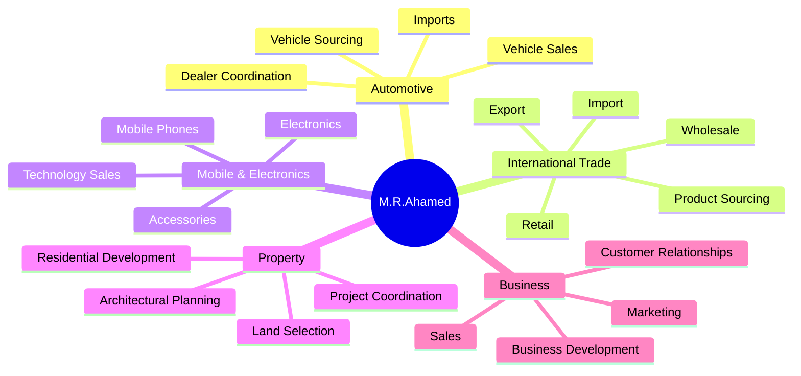

---

# 🧑‍💻 Technology Stack

<div align="center">

### ⚛️ Frontend


### ⚙️ Tooling


</div>

---

# 📊 Portfolio Technology Map

```text
React / Component Architecture    ██████████████████████████████
TypeScript                        ████████████████████████████
Desktop UI Engineering            █████████████████████████████
Responsive Design                 ███████████████████████████
Browser APIs                      █████████████████████████
State Management                  ███████████████████████████
PWA / Offline Experience          ███████████████████████
Accessibility                     ████████████████████████
Animation & Interaction           ████████████████████████████
```

<sub>This graph represents technologies and engineering areas present in the portfolio, not proficiency percentages.</sub>

---

# 🌐 Browser Capabilities

The portfolio interacts with modern web capabilities including:

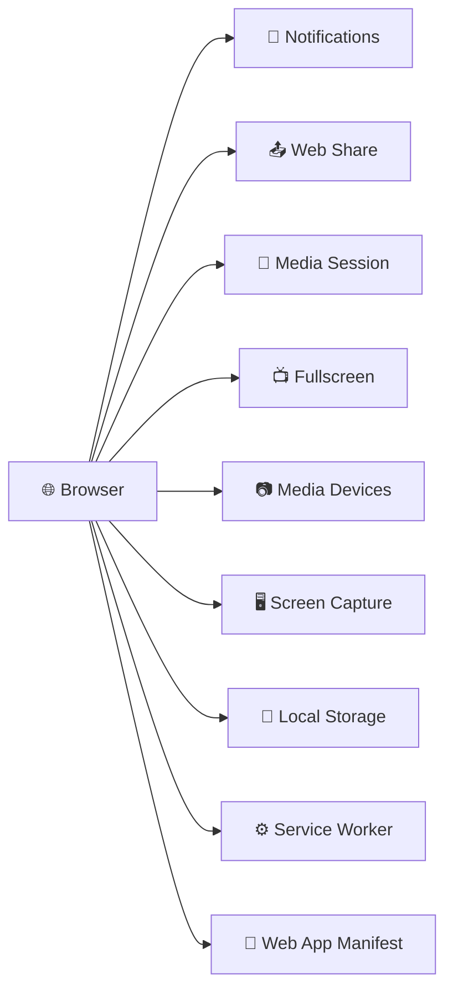

Other capabilities are used where browser support permits.

---

# 🧠 React Architecture

```text
App.tsx
   │
   ├── ⚙️ SettingsProvider
   │      └── Appearance & preferences
   │
   ├── 🖥️ SystemProvider
   │      └── Shared desktop state
   │
   ├── 🎵 MusicProvider
   │      └── Global audio / Now Playing
   │
   └── 🪟 WindowManagerProvider
          │
          └── Desktop
               │
               ├── Wallpaper
               ├── Menu Bar
               ├── Desktop Icons
               ├── Widgets
               ├── Windows
               ├── Dock
               ├── Launchpad
               ├── Spotlight
               ├── Control Center
               └── Notification Center
```

---

# 🗂️ Project Architecture

```text
M.R.Ahamed-Portfolio/
│
├── 📁 public/
│   │
│   ├── assets/
│   │   ├── 🎵 music/
│   │   ├── 📸 photos/
│   │   ├── 🖼️ screenshots/
│   │   ├── 🎬 videos/
│   │   └── 🌄 wallpapers/
│   │
│   ├── 📄 cv/
│   └── 🖼️ images/
│
├── 📁 src/
│   │
│   ├── 📱 apps/
│   │   ├── portfolio apps
│   │   ├── system apps
│   │   ├── utilities
│   │   ├── media apps
│   │   ├── communication apps
│   │   └── Game Center
│   │
│   ├── 🧩 components/
│   │   ├── Desktop
│   │   ├── Dock
│   │   ├── MenuBar
│   │   ├── Window
│   │   ├── Widgets
│   │   ├── Wallpaper
│   │   └── DesktopIcons
│   │
│   ├── 📊 data/
│   │   ├── portfolio.ts
│   │   ├── services.ts
│   │   └── media.ts
│   │
│   ├── ⚙️ system/
│   │   ├── WindowManager
│   │   ├── SettingsContext
│   │   ├── SystemContext
│   │   ├── MusicContext
│   │   └── application registry
│   │
│   ├── 🎨 styles/
│   ├── App.tsx
│   └── main.tsx
│
├── index.html
├── package.json
├── package-lock.json
├── tsconfig.json
├── vite.config.ts
├── eslint.config.js
├── UPDATE-GUIDE.md
└── README.md
```

---

# 🗃️ Centralized Portfolio Data

Core portfolio information is primarily maintained inside:

```text
src/data/portfolio.ts
```

It contains reusable information for areas such as:

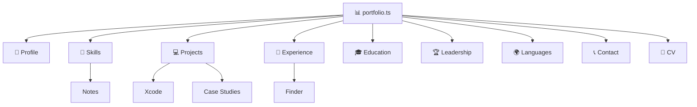

Services are maintained through:

```text
src/data/services.ts
```

Media configuration is maintained through:

```text
src/data/media.ts
```

---

# ⌨️ Terminal Portfolio

```text
╭──────────────────────────────────────────────────────────╮
│ 🔴  🟡  🟢     M.R.Ahamed — Terminal                    │
├──────────────────────────────────────────────────────────┤
│                                                          │
│  M.R.Ahamed@portfolio ~ % whoami                         │
│                                                          │
│  M.R.Ahamed                                              │
│  Computer Science Undergraduate                          │
│  Full-Stack Developer                                    │
│  Entrepreneur                                            │
│                                                          │
│  M.R.Ahamed@portfolio ~ % _                              │
│                                                          │
╰──────────────────────────────────────────────────────────╯
```

Available commands include:

```bash
help
whoami
about
skills
projects
experience
education
leadership
languages
github
linkedin
resume
contact
hire
casestudy
ask
guestbook
share
neofetch
date
uptime
pwd
ls
echo
history
man
theme
lang
clear
sleep
restart
shutdown
shortcuts
```

Terminal features include command history, keyboard navigation, completion and interactive portfolio actions.

---

# 🎨 Appearance

<div align="center">

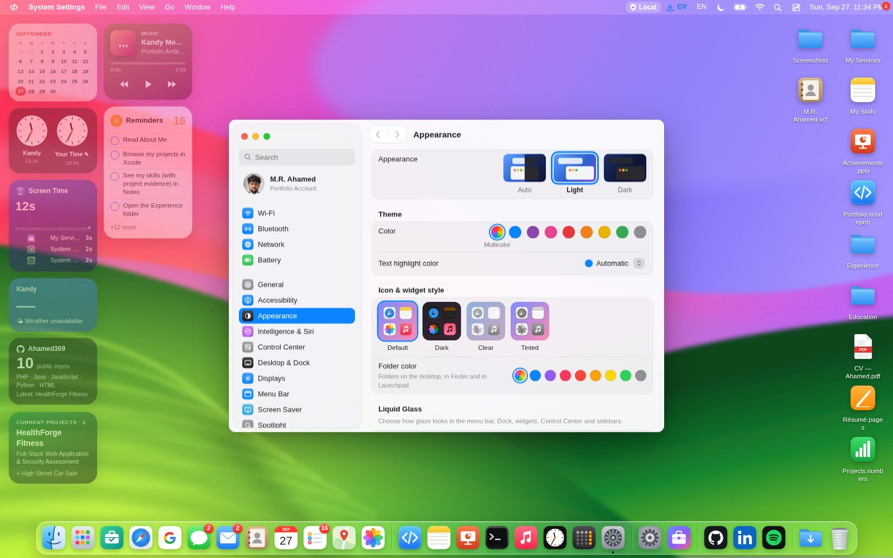

</div>

<br>

Personalization options include:

- ☀️ Light mode
- 🌙 Dark mode
- 🌓 Automatic appearance
- 🎨 Accent colors
- 🌄 Wallpaper selection
- 🖼️ Custom wallpaper
- 📌 Dock position
- 📏 Dock size
- 🔍 Dock magnification
- 👻 Dock auto-hide
- 🪄 Minimize effects
- 🗂️ Stage Manager
- 🌙 Night Shift
- 🔤 Text size
- **Bold text**
- ◐ Contrast
- 💎 Transparency
- 🐢 Reduced motion

---

# 🌙 Dark Mode

<div align="center">

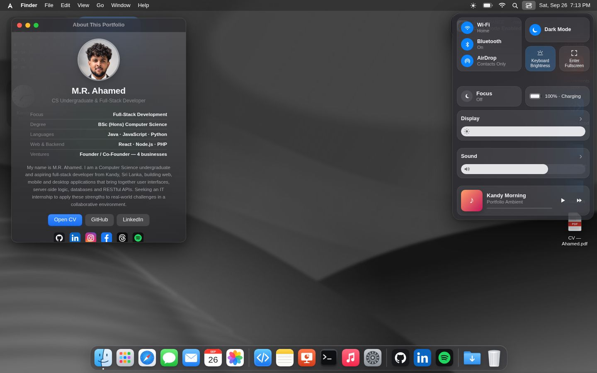

</div>

---

# 🎵 Music Experience

The integrated music system connects multiple parts of the desktop.

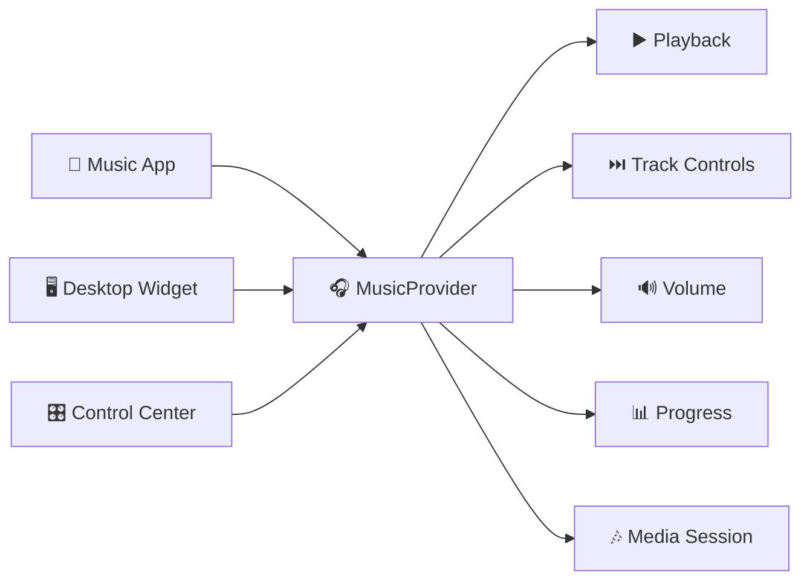

Features include:

- Play / pause
- Previous / next
- Progress tracking
- Volume
- Albums
- Artists
- Playlists
- Favorites
- Recently played
- Mini player
- Media-key integration where supported

---

# 📸 Screenshots

<details>
<summary><b>🖥️ Desktop</b></summary>
<br>
<div align="center">

</div>
</details>

<details>
<summary><b>🚀 Applications</b></summary>
<br>
<div align="center">
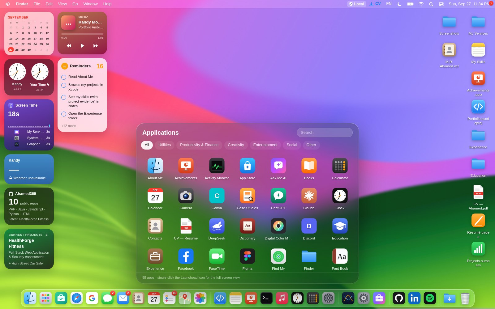
</div>
</details>

<details>
<summary><b>💻 Xcode / Projects</b></summary>
<br>
<div align="center">
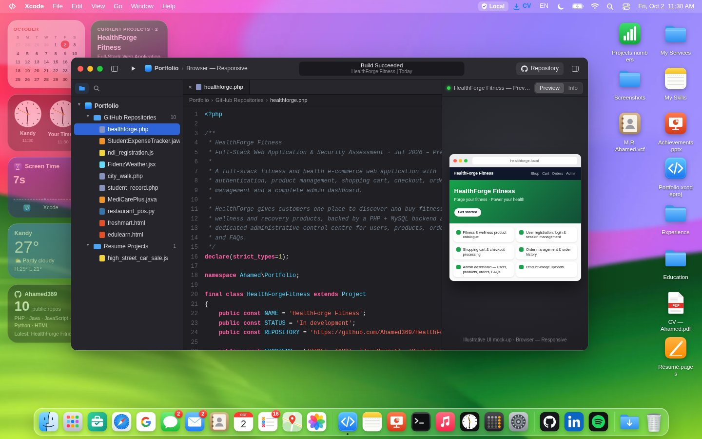
</div>
</details>

<details>
<summary><b>🧠 Notes / Skills</b></summary>
<br>
<div align="center">
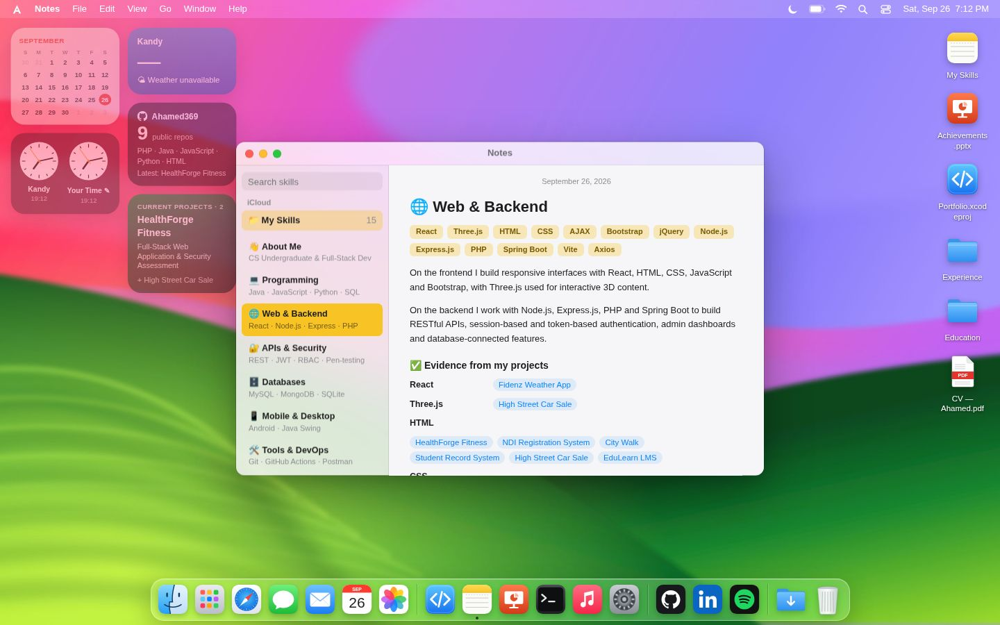
</div>
</details>

<details>
<summary><b>🛠️ Services</b></summary>
<br>
<div align="center">
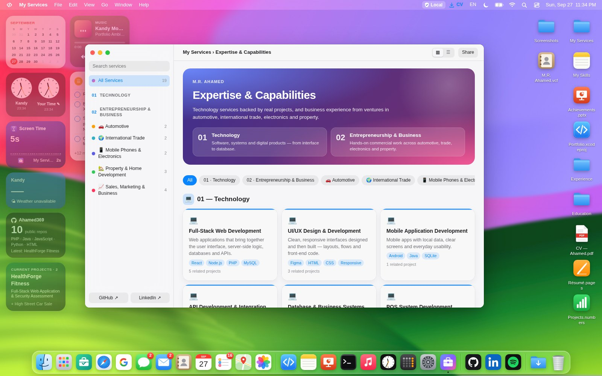
</div>
</details>

<details>
<summary><b>⚙️ System Preferences</b></summary>
<br>
<div align="center">
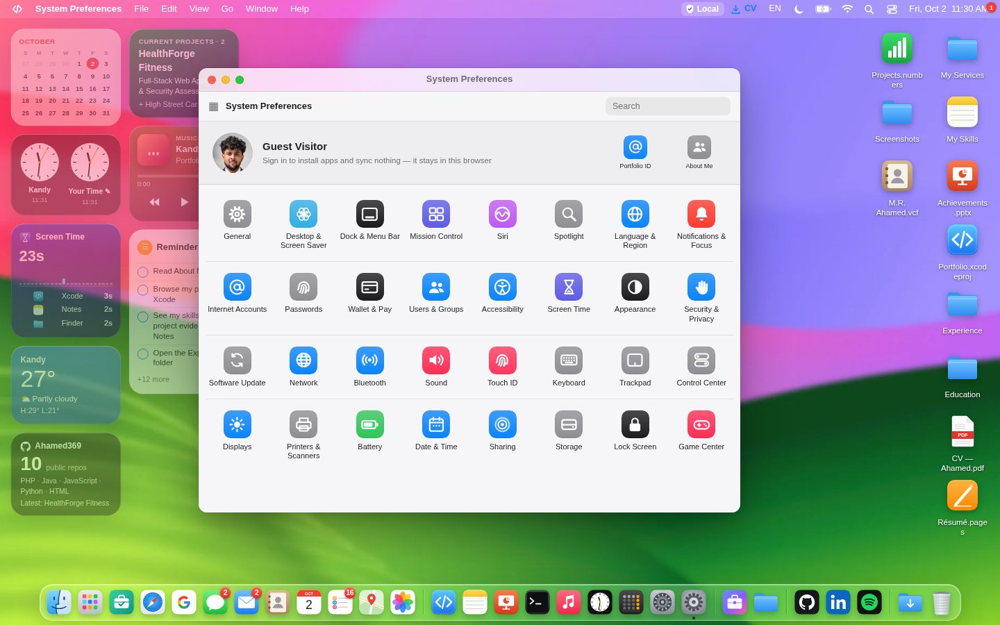
</div>
</details>

<details>
<summary><b>🏆 Achievements</b></summary>
<br>
<div align="center">
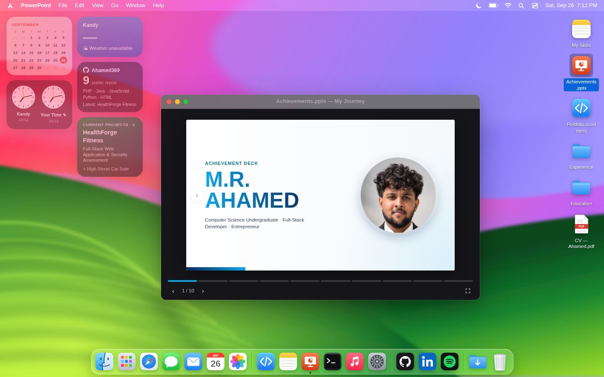
</div>
</details>

<details>
<summary><b>💼 Experience</b></summary>
<br>
<div align="center">
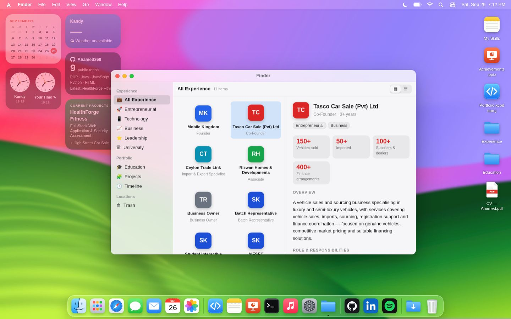
</div>
</details>

<details>
<summary><b>📈 Grapher</b></summary>
<br>
<div align="center">
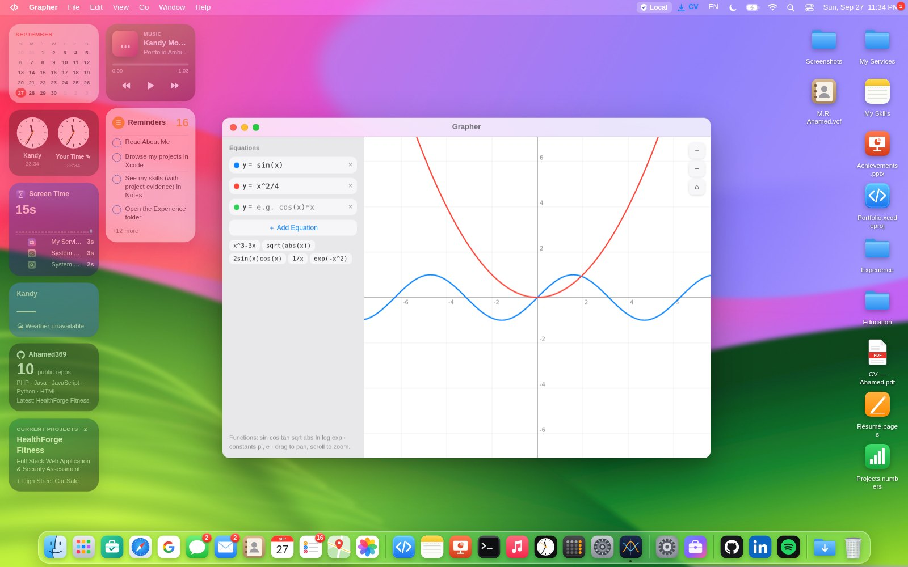
</div>
</details>

---

# 📱 Responsive Experience

```text
┌───────────────────┐
│ 🖥️ DESKTOP        │
│                   │
│ Floating windows  │
│ Full Dock          │
│ Widgets            │
│ Desktop controls  │
└─────────┬─────────┘
          │
          ▼
┌───────────────────┐
│ 📱 TABLET          │
│                   │
│ Adaptive windows  │
│ Responsive Dock   │
│ Touch support     │
└─────────┬─────────┘
          │
          ▼
┌───────────────────┐
│ 📲 MOBILE          │
│                   │
│ Full-screen apps  │
│ Touch controls    │
│ Mobile Dock       │
└───────────────────┘
```

---

# ♿ Accessibility

The project includes accessibility-oriented features such as:

```text
Keyboard Navigation        ███████████████████████
Visible Focus States       ███████████████████████
Reduced Motion             ███████████████████████
Reduced Transparency       █████████████████████
Increased Contrast         █████████████████████
Adjustable Text Size       ███████████████████████
Bold Text                  ████████████████████
Touch-Friendly Controls    ███████████████████████
```

The interface also respects supported browser and operating-system preferences where possible.

---

# 📲 Progressive Web App

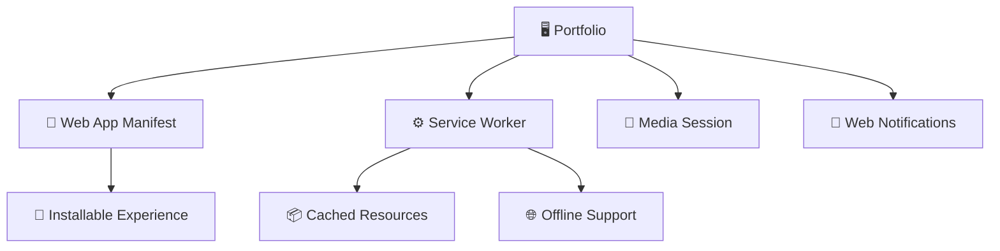

PWA capabilities include:

- Web App Manifest
- Service Worker
- Installable experience
- Cached resource support
- Offline capabilities
- Application icons
- Media Session integration
- Browser notification integration

---

# 🔐 Privacy & Permissions

Some applications use browser capabilities that require permission.

| Capability | Example |
|---|---|
| 📷 Camera | Camera application |
| 🎙️ Microphone | Voice features |
| 🔔 Notifications | Notification Center |
| 🖥️ Screen Capture | Screen tools |
| 📺 Fullscreen | Desktop experience |
| 📍 Location-related capabilities | Supported contextual features |

Permissions are requested only when a relevant feature requires them.

Browser limitations are respected. Hardware controls such as real Wi-Fi, Bluetooth and cellular radios cannot normally be controlled by a website and are therefore represented as simulated desktop interfaces unless a supported browser API is available.

---

# ⚡ Performance Architecture

Many applications are loaded separately using application-level code splitting.

```text
                         ┌─────────────┐
                         │  index.js   │
                         └──────┬──────┘
                                │
          ┌─────────────────────┼─────────────────────┐
          ▼                     ▼                     ▼
     Portfolio Apps        System Apps           Game Center
          │                     │                     │
     Lazy Loaded           Lazy Loaded           Lazy Loaded
          │                     │                     │
          └─────────────────────┼─────────────────────┘
                                ▼
                       Interactive Desktop
```

This allows many applications to be delivered as separate production chunks instead of placing every application implementation into one file.

---

# 🚀 Quick Start

## 1. Clone

```bash
git clone https://github.com/Ahamed369/M.R.Ahamed-Portfolio.git
```

## 2. Enter the project

```bash
cd M.R.Ahamed-Portfolio
```

## 3. Install dependencies

```bash
npm install
```

## 4. Start development

```bash
npm run dev
```

Vite will display the local development URL.

---

# 🏗️ Production

Build the optimized project:

```bash
npm run build
```

Production pipeline:

```text
TypeScript
     │
     ▼
Type Validation
     │
     ▼
Vite Build
     │
     ▼
Optimization
     │
     ▼
Code Splitting
     │
     ▼
dist/
```

Preview the production build:

```bash
npm run preview
```

---

# ☁️ Production Deployment

<div align="center">

[](https://m-r-ahamed-portfolio.vercel.app/)
[](https://m-r-ahamed-portfolio.vercel.app/)
[](https://m-r-ahamed-portfolio.vercel.app/)

<br>

### [Open the live portfolio](https://m-r-ahamed-portfolio.vercel.app/)


</div>

---

# 🧪 Commands

| Command | Purpose |
|---|---|
| `npm run dev` | Start development server |
| `npm run build` | Create production build |
| `npm run preview` | Preview production build |
| `npm run lint` | Run ESLint |
| `npm run typecheck` | Run TypeScript validation |

---

# 📦 Production Build Status

```text
✓ TypeScript compilation
✓ Vite production build
✓ 196 modules transformed
✓ Application chunks generated
✓ Production output generated in dist/
✓ Build completed successfully
```

> The current build succeeds. Vite reports a non-blocking large-chunk optimization warning, so additional bundle optimization remains a future performance opportunity.

---

# 🛠️ Updating the Portfolio

### 👤 Personal information

```text
src/data/portfolio.ts
```

### 💼 Services

```text
src/data/services.ts
```

### 🎵 Media

```text
src/data/media.ts
```

### 📄 CV

```text
public/cv/
```

### 🖼️ Images

```text
public/images/
```

### 🌄 Wallpapers / Screenshots / Media

```text
public/assets/
```

For additional maintenance information:

```text
UPDATE-GUIDE.md
```

---

# 🌐 Browser Support

<div align="center">


</div>

Some advanced APIs depend on browser, operating system, device and permission support.

---

# 🗺️ Roadmap

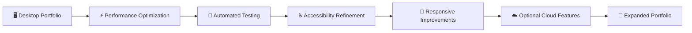

Potential future improvements include:

- Additional bundle optimization
- More portfolio case studies
- Expanded automated testing
- Additional accessibility testing
- Further mobile refinements
- Backend-powered guestbook capabilities
- Optional cloud integrations
- Additional applications
- Further PWA improvements

---

# ⚠️ Project Notice

This is a **web-based portfolio inspired by desktop operating-system interaction patterns**.

It is **not macOS** and is not affiliated with or endorsed by Apple Inc.

Apple, macOS and other third-party product or service names belong to their respective owners.

Third-party application names, logos and services referenced within the portfolio remain the property of their respective owners and are used only for identification, portfolio demonstration or navigation purposes.

---

# 👨‍💻 About the Developer

<div align="center">

## M.R.Ahamed


📍 **Kandy, Sri Lanka**

<br>

[](https://github.com/Ahamed369)

[](https://www.linkedin.com/in/mr-ahamed-6146a5276)

[](mailto:ahamedrock369@gmail.com)

<br>

---

### 💻 Explore the Code
### 🖥️ Launch the Desktop
### 🚀 Discover the Projects
### 🤝 Let's Build Something Meaningful

<br>

[](https://m-r-ahamed-portfolio.vercel.app/)

<br>


###  Think Different. Build Different.

**Designed & Developed by M.R.Ahamed**

`React 19` • `TypeScript` • `Vite 6`

**© 2026 M.R.Ahamed**

</div>
