# 🍎 M.R.Ahamed — Interactive Portfolio OS

<div align="center">

### 💻 Mac Experience · 📱 iPhone Experience · 🖥️ iPad Experience


<br>


<br>

**Not just a portfolio page — an interactive browser-based portfolio operating-system experience.**

<br>

[](https://m-r-ahamed-portfolio.vercel.app/)
[](https://github.com/Ahamed369/M.R.Ahamed-Portfolio)
[](https://react.dev/)
[](https://www.typescriptlang.org/)
[](https://vite.dev/)
[](https://m-r-ahamed-portfolio.vercel.app/)

<br>

[](https://github.com/Ahamed369)
[](https://www.linkedin.com/in/mr-ahamed-6146a5276)
[](mailto:ahamedrock369@gmail.com)

</div>

---

# 🚀 Launch the Experience

<div align="center">

<a href="https://m-r-ahamed-portfolio.vercel.app/">

</a>

<br><br>

[](https://m-r-ahamed-portfolio.vercel.app/)

**💻 Mac · 📱 iPhone · 🖥️ iPad · 📄 Classic**

</div>

---

# ✨ What Makes This Portfolio Different?

Most portfolios are websites you scroll through.

**This portfolio is a system you explore.**

| Traditional Portfolio | M.R.Ahamed Portfolio OS |
|---|---|
| Static navigation | 🚀 Apps + system navigation |
| One responsive page | 💻📱🖥️ Three device experiences |
| Normal cards | 🪟 Interactive windows |
| Static project list | 🧑‍💻 Xcode-style project experience |
| Fixed background | 🎨 Wallpaper system |
| Basic menu | 🎛️ Control Centre |
| No system search | 🔎 Spotlight |
| Static screenshots | ⚡ Interactive applications |
| No file management | 📂 Finder + My Files |
| No games | 🎮 20 playable games |
| No live information | 🌦️ Live weather |
| No media system | 🎵 Music + Now Playing |
| Basic contact form | 💬 Guestbook + Hire Me |
| No device simulation | 📱 iPhone + 🖥️ iPad + 💻 Mac |

### 🌟 Signature Features

- 💻 Mac-inspired interactive desktop
- 📱 Dedicated iPhone/iOS-style experience
- 🖥️ Dedicated iPad/iPadOS-style experience
- 🪟 Custom window-management system
- 🚀 Dock
- 🔎 Spotlight
- 🧩 Widgets
- 🎛️ Control Centre
- 🔔 Notification Centre
- 🏝️ Dynamic Island
- 🔒 Lock Screens
- 🎨 Wallpaper Studio
- 🌦️ Live Weather
- 🎵 Music
- 🎮 Game Center
- 💬 Guestbook
- 📂 Finder
- 📁 My Files
- 📸 Photos
- 📝 Notes
- ⏰ Reminders
- 📚 Learning Hub
- 🤖 Portfolio Assistant
- ⌨️ Interactive Terminal
- 📦 PWA / offline support
- 🌐 English, Sinhala and Tamil interface support

---

# 💻 📱 🖥️ Three Devices — Three Experiences

## 💻 Mac Experience

<div align="center">

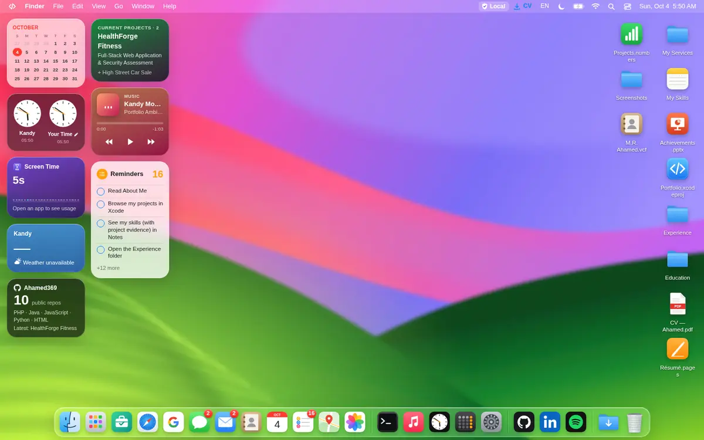

</div>

The desktop version is designed as an interactive Mac-inspired portfolio environment.

### 🪟 Window System

- Drag windows
- Resize windows
- Focus and z-index management
- Minimize
- Restore
- Maximize
- Window tiling
- Half-screen layouts
- Quarter-screen layouts
- App switching
- Show All Windows
- Hide applications
- Multiple desktop Spaces
- Mission Control
- Stage Manager-inspired workflows
- Hot Corners
- Genie-style minimizing
- Scale minimizing
- Keyboard window controls

<div align="center">

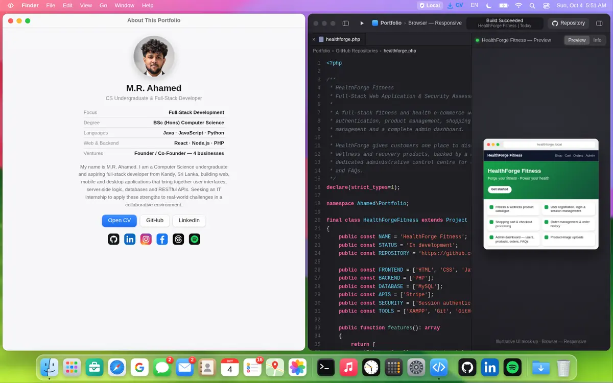
&nbsp;
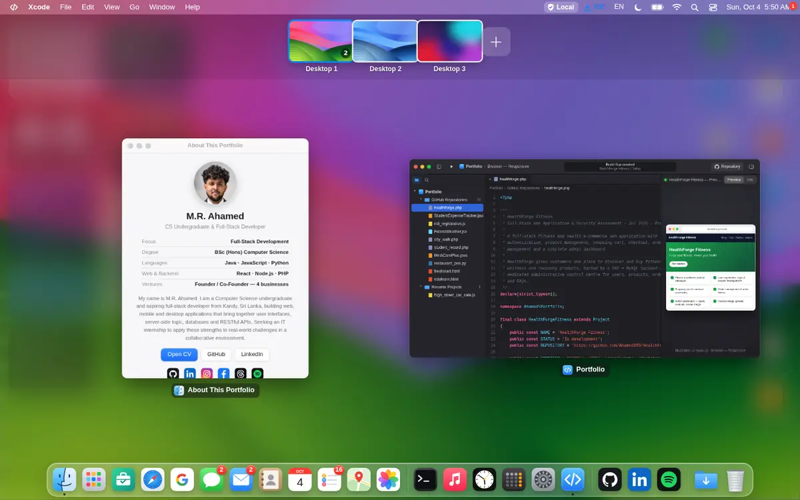

</div>

---

## 🚀 Dock

The Dock behaves as an application launcher and running-app manager.

### Dock Features

- Application launching
- Running indicators
- Minimized windows
- Magnification
- Auto-hide
- Recent applications
- Keep in Dock
- Open at Login
- Show in Finder
- Add to Desktop
- Remove from Dock
- New Window
- Show All Windows
- Context menus
- Trash state

---

# 🔎 Spotlight

<div align="center">

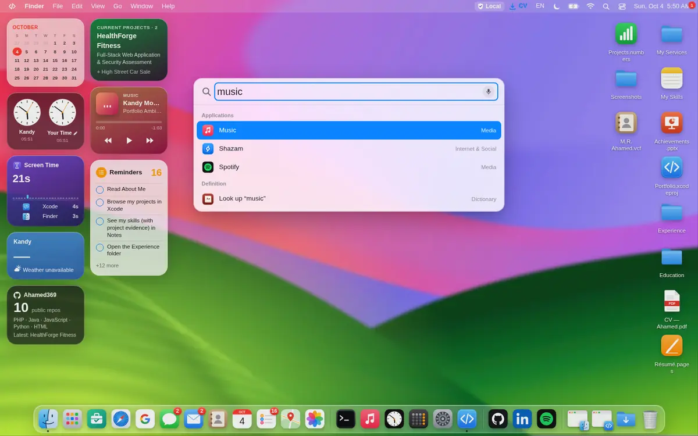

</div>

Spotlight provides system-wide portfolio search.

Search across:

- Applications
- Projects
- Experience
- Skills
- Portfolio sections
- Settings
- System actions

---

# 🚀 Launchpad

<div align="center">

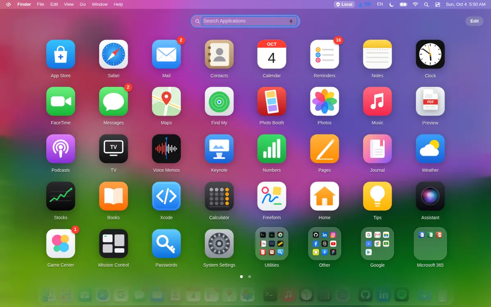

</div>

Launchpad provides an application-grid experience for discovering the portfolio's application ecosystem.

---

# 🪟 Mission Control

<div align="center">


</div>

Mission Control provides a visual overview of running windows and desktop spaces.

---

# 🧩 Widgets

<div align="center">

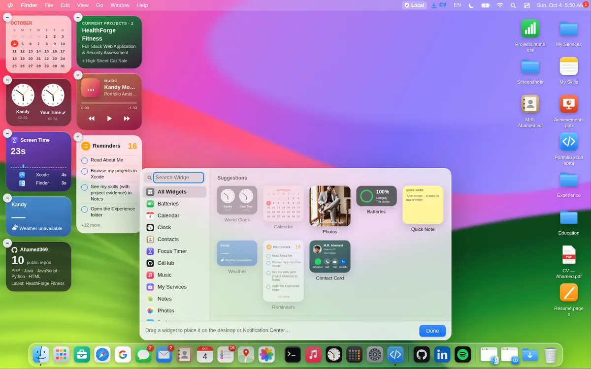

</div>

The portfolio includes a widget environment with:

- Widget gallery
- Live previews
- Desktop placement
- Notification Centre placement
- Grid snapping
- Calendar widgets
- Clock widgets
- Portfolio information widgets
- Device-aware presentation

---

# 🎛️ Mac Control Center

<div align="center">

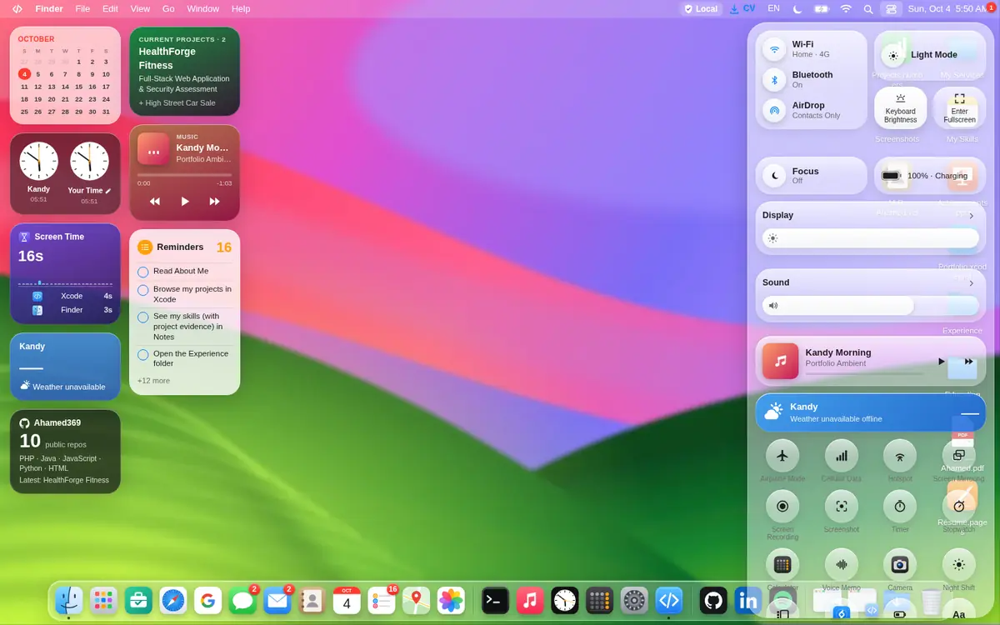

</div>

### Controls include

- 📶 Wi-Fi
- 🟦 Bluetooth
- 🌙 Focus
- 🪟 Stage Manager
- ☀️ Brightness
- 🔊 Volume
- 🔋 Low Power Mode
- 🔠 Text Size
- ♿ Accessibility
- 🎵 Recognize Music
- 📝 Quick Note
- 📹 FaceTime
- 📤 Share Portfolio
- 💼 Hire Me

---

# 🔔 Mac Notification Center

<div align="center">

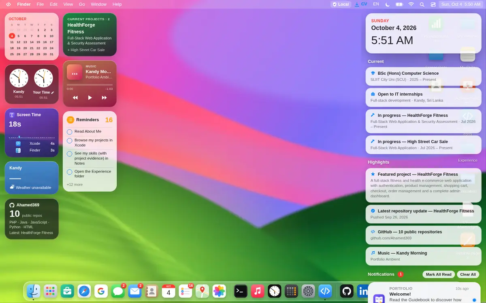

</div>

### Notification Features

- Notification cards
- Read/unread state
- Dismiss actions
- Swipe behavior
- Action buttons
- Application badges
- Notification sounds
- Notification settings
- Scheduled portfolio notifications

---

# ⚙️ System Settings

<div align="center">

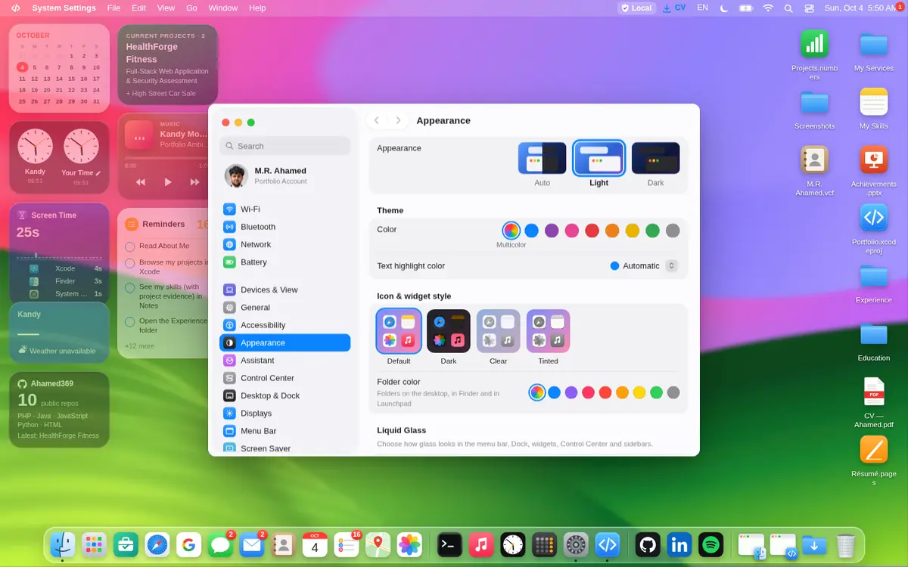

</div>

Settings acts as the control room for the portfolio.

### 🌐 Connectivity

- Wi-Fi
- Bluetooth
- Network

### 🔋 Power

- Battery
- Low Power Mode
- Battery information

### ⚙️ General

- About
- Software Update
- Storage
- AirDrop & Handoff
- Language & Region
- Date & Time
- Login Items

### ♿ Accessibility

- Reduce Motion
- Increase Contrast
- Text Size
- Reduce Transparency
- AssistiveTouch

### 🎨 Appearance

- Light Mode
- Dark Mode
- Automatic appearance
- Accent colours
- Highlight colours
- Interface styling

### 🖥️ Desktop & Dock

- Dock size
- Magnification
- Mission Control
- Hot Corners
- Windows
- Desktop icons
- Widgets
- Stage Manager concepts

### 🖼️ Wallpaper

- Wallpaper library
- Dynamic wallpaper concepts
- Device-specific wallpaper
- Home Screen wallpaper
- Lock Screen wallpaper

### 🔔 Notifications

- Application notifications
- Banners
- Sounds
- Badges
- Previews
- Scheduled Summary

### 🔊 Sound

- Volume
- Alerts
- Output
- Input
- Startup sounds

### 🌙 Focus

- Focus mode
- Do Not Disturb concepts

### ⏳ Screen Time

- Usage
- App activity
- Limits
- Downtime

### 🔒 Lock Screen

- Lock settings
- Clock styling
- Device behavior

### 🛡️ Privacy & Security

- Camera permission concepts
- Microphone permission concepts
- Location permission concepts
- Browser privacy

### 🤖 Assistant

- Portfolio Assistant preferences

### 🎮 Game Center

- Nickname
- Scores
- Achievements

### ⌨️ Keyboard

- Keyboard preferences
- Shortcuts

### 🖱️ Trackpad

- Gesture preferences
- Scrolling concepts
- Tracking concepts

### 📱 Devices & View

- Mac
- iPhone
- iPad
- Device-specific behavior

### 🗑️ Trash & Undo

- Recently Deleted
- Restore
- Undo
- Redo
- Delete confirmations

---

# 📱 iPhone / iOS-Style Experience

<div align="center">

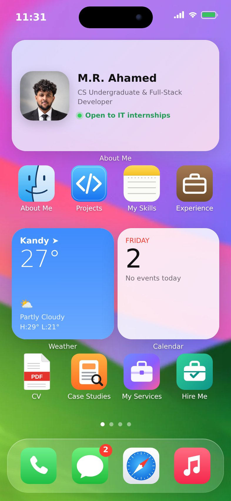

</div>

The iPhone version is **not simply the desktop squeezed onto a phone**.

It has its own mobile shell and interaction model.

## 🏠 Home Screen

<div align="center">

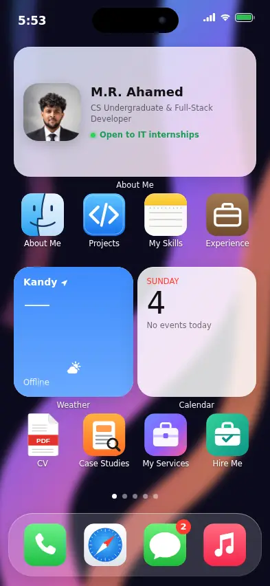

</div>

### Home Screen Features

- iOS-style application grid
- Four-app Dock
- Multiple pages
- Page indicators
- Search
- App Library
- Application badges
- Widgets
- Edit mode
- Folders
- Wallpaper-aware styling
- Device-specific persistence

---

# 🔒 iPhone Lock Screen

<div align="center">

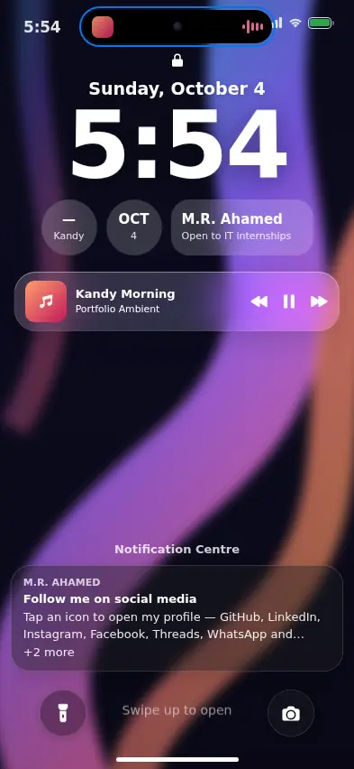

</div>

### Lock Screen Features

- Wallpaper-first design
- Custom clock
- Clock font selection
- Clock colour
- Notification presentation
- Count mode
- Stack mode
- List mode
- Torch shortcut
- Camera shortcut
- Lock sound
- Saved Lock Screens
- Long-press customization
- Separate Lock/Home wallpapers

---

# 🏝️ Dynamic Island

<div align="center">

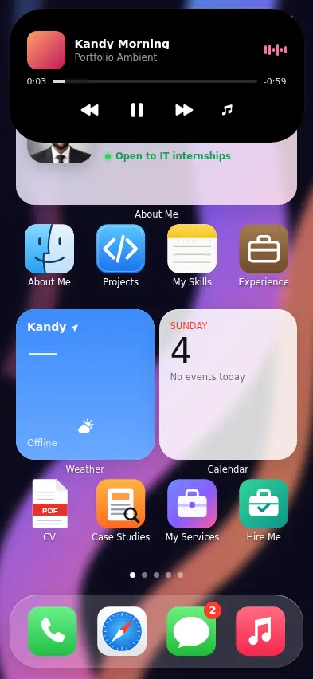

</div>

Dynamic Island is used as an activity surface.

### Activities

- 🎵 Music
- ⏱️ Timer
- 🤖 Portfolio Assistant
- 🎙️ Voice recording
- 🔴 Screen recording
- 📞 Calls
- 🔦 Torch
- 🌙 Focus alerts
- 🔕 Silent-mode alerts
- 🔋 Battery alerts

It can display simultaneous activity concepts and expand into richer controls.

---

# 🎛️ iPhone Control Centre

<div align="center">

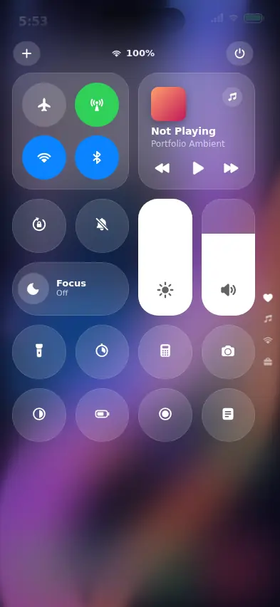

</div>

### Control Centre Features

- Favourites
- Media controls
- Connectivity
- Work controls
- Multiple pages
- Side navigation
- Edit mode
- Add Control
- Search controls
- Browse by application
- Drag/reorder controls
- Resize controls
- Remove controls
- Restore defaults
- Persistent layout

---

# 🔔 iPhone Notification Centre

<div align="center">

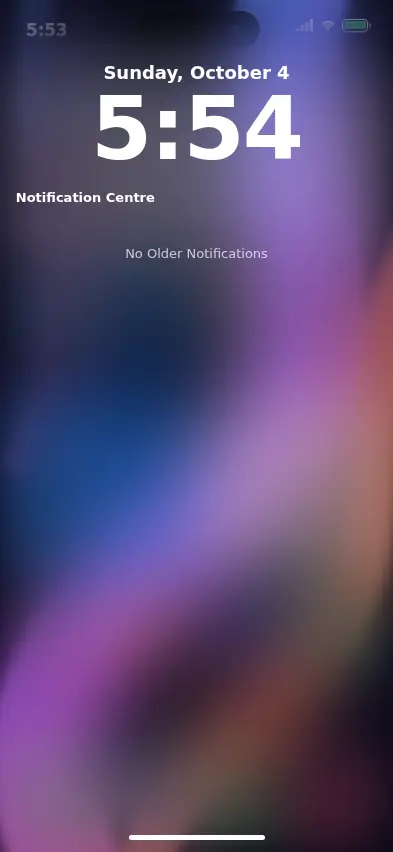

</div>

Notifications integrate with the portfolio-wide notification system.

---

# 🔄 iPhone App Switcher

<div align="center">

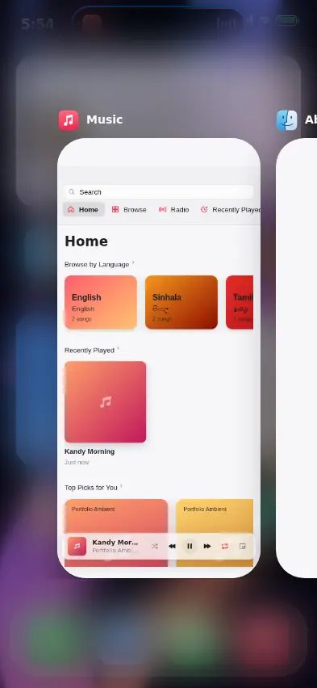

</div>

---

# ⚙️ iPhone Settings

<div align="center">

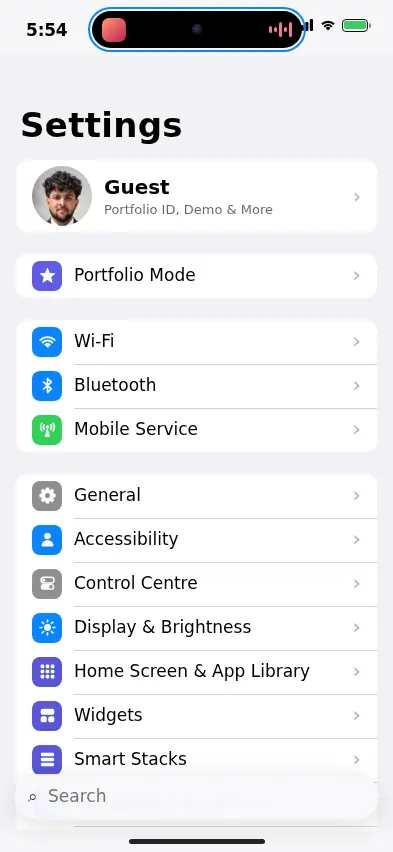

</div>

Mobile settings include:

- Home Screen options
- Lock Screen options
- Control Centre customization
- Dynamic Island
- AssistiveTouch
- Back Tap concepts
- Display Zoom
- Keyboard clicks
- Device presentation

---

# 🖥️ iPad / iPadOS-Style Experience

<div align="center">

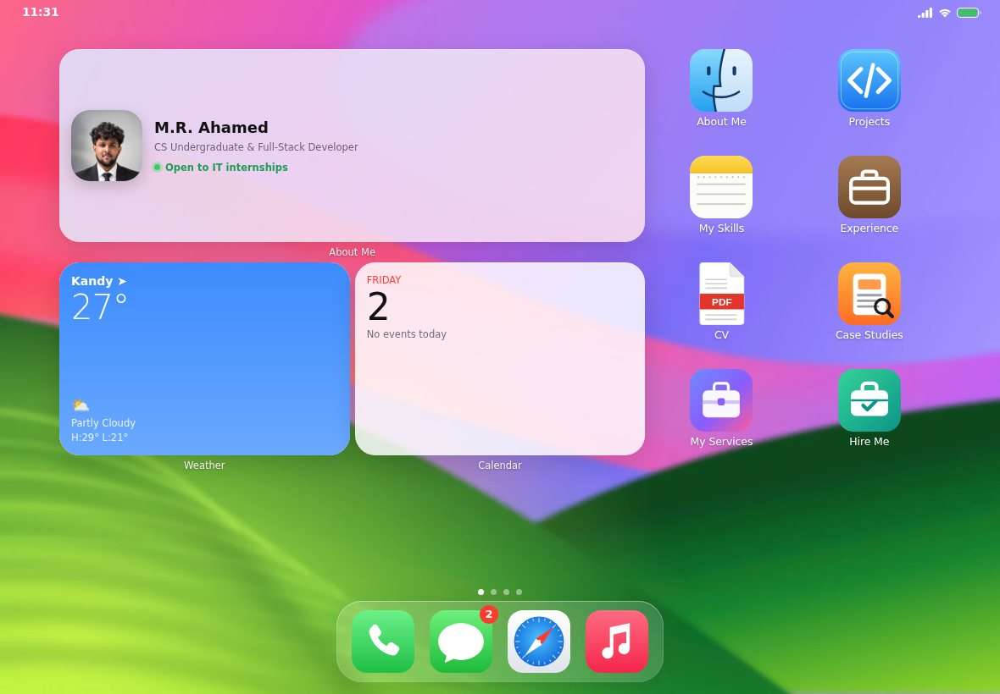

</div>

The iPad experience has its own tablet-oriented shell.

## 🏠 iPad Home

<div align="center">

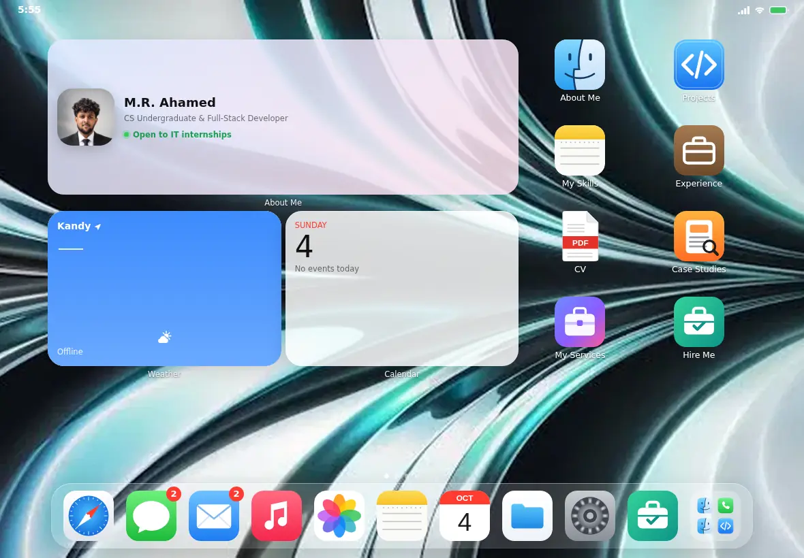

</div>

### iPad Experience

- Tablet application grid
- Adaptive Dock
- Portrait mode
- Landscape mode
- App Library
- Widgets
- Multitasking concepts
- Split View concepts
- Stage Manager-inspired workflows
- Tablet-specific spacing

---

# 🎛️ iPad Control Centre

<div align="center">

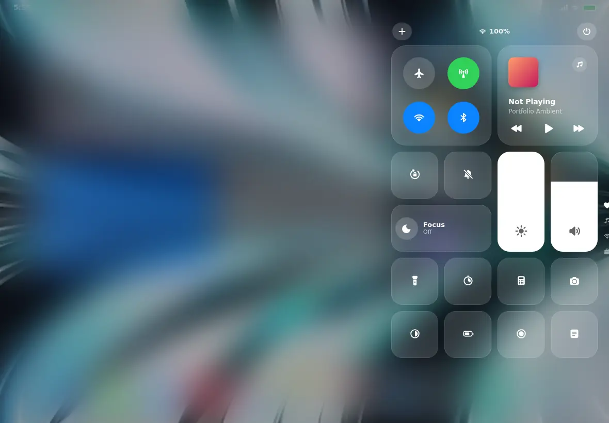

</div>

---

# 🔄 iPad App Switcher

<div align="center">

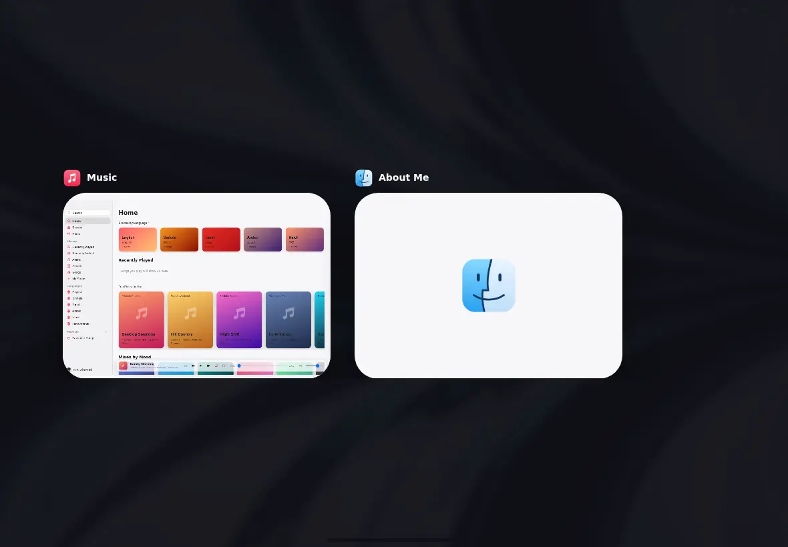

</div>

---

# 🔒 iPad Lock Screen

<div align="center">

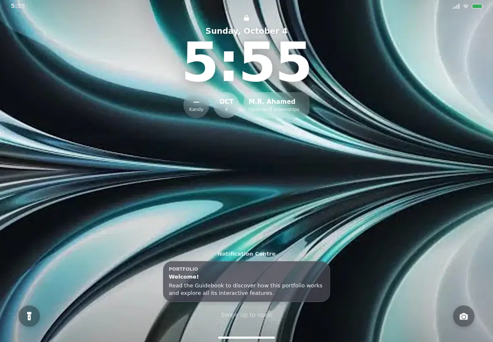

</div>

---

# ✏️ iPad Edit Mode

<div align="center">

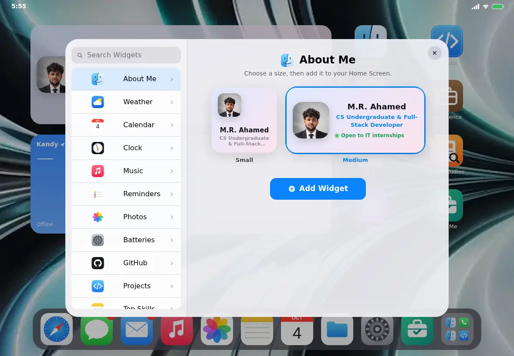

</div>

---

# 🎨 Wallpaper Studio

The project includes a large wallpaper system instead of one static background.

### 🌄 Features

- 💻 Mac wallpapers
- 📱 iPhone wallpapers
- 🖥️ iPad wallpapers
- ☀️ Light variants
- 🌙 Dark variants
- ✨ Dynamic wallpaper concepts
- 🌊 Live/code-driven wallpapers
- 🔎 Wallpaper search
- 🗂️ Categories
- 🔒 Lock Screen preview
- 🏠 Home Screen preview
- 🖥️ iPad portrait preview
- 🖥️ iPad landscape preview
- 🔗 Apply as pair
- 🏠 Apply to Home
- 🔒 Apply to Lock
- 🌫️ Home Screen blur
- 🎨 Wallpaper-aware tint
- 📷 User-selected photos
- ⚡ Motion awareness
- 🔋 Low Power awareness
- ♿ Reduced Motion support

### 🖼️ Wallpaper Gallery

<div align="center">


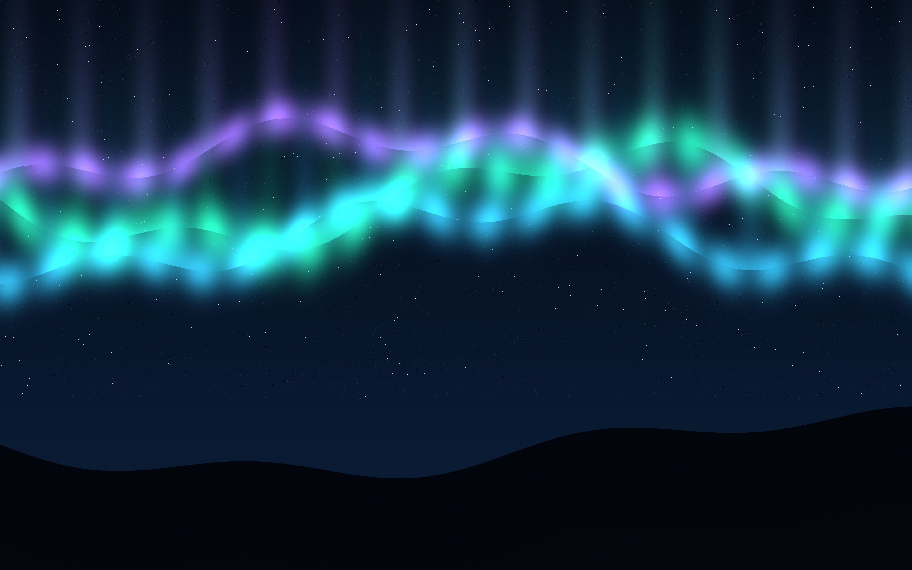


</div>

Wallpaper styles include:

`Liquid Glass` · `Lone Cypress` · `Mesh Coral` · `Mesh Ocean` · `Midnight` · `Navy Waves` · `Northern Lights` · `Ocean Shore` · `Peaks` · `Pro Light` · `Pro Dark` · `Sage Waves` · `Sonoma` · `Sunset` · `Tahoe`

---

# 🌦️ Live Weather

The Weather application uses runtime forecast information rather than a fixed weather card.

```text
🌦️ Weather
│
├── 🌡️ Current Temperature
├── 🌡️ Feels Like
├── 💧 Relative Humidity
├── 🌬️ Wind Speed
├── 🌧️ Precipitation
├── 🕒 Hourly Forecast
├── 📅 10-Day Forecast
├── 🌅 Sunrise
├── 🌇 Sunset
├── ☀️ UV Index
└── 🌧️ Precipitation Probability
```

### Weather Features

- 📍 Kandy as the primary portfolio location
- 🔎 City search
- ➕ Add cities
- 🗂️ Saved locations
- 🌡️ Celsius / Fahrenheit
- 🕒 City-local time
- 🗺️ Map panel
- 🌅 Sunrise / sunset
- ☀️ UV information
- 🌧️ Weather-aware visuals
- 💾 Cached forecast fallback

Forecast data is fetched at runtime using **Open-Meteo**.

---

# 🎵 Music — Portfolio Soundtrack

The project includes an interactive Music experience and original/synthesized portfolio audio assets.

### 🎼 Music Features

- 🎶 Portfolio music library
- 🌍 Language-style browsing
- 🎧 Genre browsing
- 😊 Mood browsing
- 🕘 Recently Played
- 📂 User playlists
- 🎵 My Songs
- ➕ Import local music
- 💾 Browser-local persistence
- ▶️ Global playback
- 🎚️ Volume controls
- 🎼 Now Playing
- 🔒 Lock Screen media integration
- 🏝️ Dynamic Island integration
- 🎛️ Control Centre integration
- ⌨️ Media-key support where available
- 📺 Mini-player / PiP concepts

### 🌍 Musical Styles

- 🇬🇧 English
- 🇱🇰 Sinhala
- 🇱🇰 Tamil
- 🌙 Arabic
- 🇮🇳 Hindi

### 🎧 Included Portfolio Tracks

- Ceylon Rain
- Focus Mode
- Galle Sunset
- Ella Train
- Hill Train Lofi
- Kandy Morning
- Late Night Review
- Lotus Pond
- Monsoon Code
- Night Compile
- Peradeniya Walk
- Sigiriya Dawn
- Tea Country

---

# 🎮 Game Center

## 🏆 20 Playable Games

| # | Game | Category |
|---:|---|---|
| 01 | 🐍 Snake | Arcade |
| 02 | 🔢 2048 | Puzzle |
| 03 | 9️⃣ Sudoku | Puzzle |
| 04 | 🧱 Block Drop | Arcade |
| 05 | 💣 Minesweeper | Classic |
| 06 | ❌⭕ Tic-Tac-Toe | Classic |
| 07 | 🔴 Connect Four | Classic |
| 08 | 🃏 Memory Match | Brain & IQ |
| 09 | 🧠 IQ Quiz | Brain & IQ |
| 10 | ➗ Math Sprint | Brain & IQ |
| 11 | 🟢 Simon Says | Brain & IQ |
| 12 | ⚡ Reaction Time | Brain & IQ |
| 13 | 🔤 Word Guess | Word |
| 14 | ⌨️ Typing Speed | Word |
| 15 | 🧱 Brick Breaker | Arcade |
| 16 | 🐤 Flappy Dot | Arcade |
| 17 | 🏙️ Stack Tower | Arcade |
| 18 | 🐹 Whack-a-Mole | Arcade |
| 19 | 🏓 Pong | Classic |
| 20 | ✂️ Rock Paper Scissors | Classic |

### 🏆 Game Center Systems

- Daily Challenge
- Daily target
- Streaks
- Achievements
- Achievement notifications
- Local leaderboards
- Best scores
- Continue Playing
- Search
- Categories
- Persistent progress
- Keyboard controls
- Touch controls
- Swipe controls where supported

```text
🎮 PLAY
   │
   ▼
🏁 FINISH
   │
   ▼
🧮 SCORE
   │
   ├──────────► 🏆 LEADERBOARD
   │
   ├──────────► 🥇 ACHIEVEMENT
   │
   ├──────────► 📅 DAILY CHALLENGE
   │
   └──────────► 🔥 STREAK
```

---

# 💬 Guestbook

Visitors can interact with the portfolio through the Guestbook.

### Guestbook Features

- ✍️ Sign Guestbook
- 📝 Edit
- 🗑️ Delete
- ❤️ Like
- 📋 Copy
- 📤 Share
- 🔎 Search
- ↕️ Sort
- 🙂 Mood
- 📍 Optional location
- 💾 Local persistence behavior
- 🌐 Remote-aware behavior
- ✉️ Optional owner-notification endpoint

---

# 📂 Finder + My Files

<div align="center">


</div>

Finder acts both as a portfolio navigator and local file environment.

### 🗂️ Portfolio Locations

- 💼 All Experience
- ✨ Entrepreneurial
- 💻 Technology
- 📊 Business
- ⭐ Leadership
- 🎓 University
- 🎓 Education
- 🧑‍💻 Projects
- 🕒 Timeline
- 📁 My Files
- 🗑️ Trash
- 🏷️ Tags

## 📁 My Files

Visitors can add files from their own device.

### Supported Experiences

- 🖼️ Image preview
- 🎬 Video preview
- 🎵 Audio playback
- 📄 PDF preview
- 📝 Text preview
- 💻 Code preview
- ✏️ Rename
- 📑 Duplicate
- ⬇️ Download
- 🗑️ Delete
- 🏷️ Tags
- 💾 Browser-local persistence

Visitor files are designed to remain local to the browser rather than being silently uploaded.

---

# 📸 Photos

### Photos Features

- Portfolio photo library
- Wallpaper album
- Video section
- Portfolio recordings
- Imports
- Drag-and-drop photos
- Add Photos
- Use Photo as Wallpaper
- Local visitor imports
- Recently Deleted concepts
- Hidden album concepts
- Editing concepts

---

# 🌐 Safari-Style Browser

### Safari Features

- Tabs
- Mac-style tab strip
- iPhone tab grid
- Private Browsing concepts
- Reading List
- Favorites
- GitHub shortcuts
- External navigation
- Device-specific layouts

---

# 🔔 Notification System

```text
📱 Application
      │
      ▼
🔔 Notification Engine
      │
      ├── Banner
      ├── Sound
      ├── Badge
      ├── Notification Centre
      ├── Read / Unread
      └── Browser Notification
```

### Notification Features

- Glass notification cards
- Read/unread state
- Close controls
- Swipe dismiss
- Context actions
- Action buttons
- Application badges
- Mark All Read
- Clear All
- Per-app banners
- Per-app sounds
- Per-app badges
- Show Previews
- Scheduled Summary
- Reminder notifications
- Browser notifications where supported

---

# 🧊 Control Centre Architecture

```text
                    🎛️ CONTROL CENTRE
                           │
        ┌──────────────────┼──────────────────┐
        │                  │                  │
        ▼                  ▼                  ▼
   ⭐ Favourites       🎵 Media          📶 Connectivity
        │
        ├──────────────► 💼 Work
        │
        └──────────────► ✏️ Edit Mode
                              │
                  ┌───────────┼────────────┐
                  ▼           ▼            ▼
              ➕ Add       ↔️ Move      ↔ Resize
                  │
                  ├────────► 🗑 Remove
                  ├────────► 📱 Browse by App
                  └────────► ♻️ Restore Defaults
```

The controls adapt across Mac, iPhone and iPad layouts.

---

# 🏝️ Dynamic Island Activity Model

```text
                     🏝️ DYNAMIC ISLAND
                            │
      ┌─────────┬───────────┼──────────┬─────────┐
      ▼         ▼           ▼          ▼         ▼
    🎵 Music  ⏱️ Timer   🤖 Assistant  🎙️ Rec   📞 Call
      │         │           │          │         │
      └─────────┴───────────┼──────────┴─────────┘
                            ▼
                       Expanded View

Additional temporary states:
🌙 Focus · 🔕 Silent · 🔋 Battery · 🔦 Torch
```

---

# 🔒 Lock Screen System

### Features

- Saved Lock Screens
- Long-press switching
- Create new
- Customize
- Delete
- Wallpaper selection
- Clock font
- Clock colour
- Notification style
- Torch shortcut
- Camera shortcut
- Lock sound
- Separate Home/Lock wallpaper

---

# 🧩 Widgets & Smart Stacks

### 💻 Mac

- Widget gallery
- Live previews
- Desktop placement
- Notification Centre placement
- Grid snapping

### 📱 iPhone

- Widget gallery
- Edit mode
- Movement
- Grid snapping
- Smart Stacks
- Swipe stacks
- App deep links

### 🖥️ iPad

- Larger widget layouts
- Tablet placement
- Edit mode
- Smart Stack concepts
- Responsive grids

---

# 🤖 Portfolio Assistant

The assistant is presented as **M.R.Ahamed's Portfolio Assistant**.

It can help visitors explore:

- 👤 About
- 🧑‍💻 Projects
- 💻 Skills
- 💼 Experience
- 🎓 Education
- 🛠️ Services
- 📚 Case Studies
- ⚙️ Settings
- 🎨 Wallpapers
- ⏱️ Timers
- 📞 Contact
- 🤝 Hiring information

---

# 📚 Learning Hub

### Learning Features

- 📖 Learning topics
- ✅ Mark as studied
- 📝 Save to Notes
- ❓ Quizzes
- 🃏 Flashcards
- 🎯 Focus Planner
- 📋 Goals & Tasks
- 💼 Business Planner
- 💻 Code Playground
- 📄 Documents
- 📖 Guidebook

---

# 📖 Built-In Guidebook

The project includes an A–Z Guidebook containing real screenshots from the portfolio.

## 💻 Mac Guide

<div align="center">


</div>

## 📱 iPhone Guide

<div align="center">


</div>

## 🖥️ iPad Guide

<div align="center">


</div>

---

# 🧑‍💼 Portfolio Modes

### 👔 Recruiter Mode

Focuses on:

`Skills` · `Experience` · `CV` · `Projects` · `Contact`

### 🤝 Client Mode

Focuses on:

`Services` · `Case Studies` · `Business` · `Hire Me`

### 👨‍💻 Developer Mode

Focuses on:

`Architecture` · `GitHub` · `Technology` · `Terminal` · `Projects`

### 🎤 Presentation Mode

Designed for guided portfolio walkthroughs.

---

# 💼 Professional Portfolio Applications

| App | Purpose |
|---|---|
| 👤 About | Personal profile |
| 🧑‍💻 Projects / Xcode | Project showcase |
| 📚 Case Studies | Detailed project stories |
| 📝 Notes | Skills and technical knowledge |
| 📂 Finder | Experience and education |
| 📄 Preview | Résumé / CV |
| 🛠️ My Services | Services |
| 🤝 Hire Me | Professional contact |
| 🏆 Achievements | Milestones |
| ⌨️ Terminal | CLI portfolio |
| 🤖 Ask Me AI | Portfolio Assistant |
| 💬 Guestbook | Visitor interaction |
| 📖 Guidebook | Complete system guide |

---

# 🛠️ Services

## 💻 Technology

- Full-Stack Development
- Web Applications
- APIs
- Database Development
- UI/UX
- Mobile-oriented Development
- Software Engineering
- Business Systems

## 💼 Entrepreneurship & Business

- Automotive
- Import / Export
- Mobile & Electronics
- Property Development
- Sales
- Marketing
- Business Development
- Customer Relationships

---

# 🧰 Utility Applications

The portfolio ecosystem includes utilities such as:

`Calculator` · `Calendar` · `Clock` · `Weather` · `Maps` · `Find My` · `Home` · `Measure` · `Dictionary` · `Translate` · `Font Book` · `Grapher` · `Digital Color Meter` · `Activity Monitor` · `Passwords` · `Time Machine` · `iPhone Mirroring` · `System Settings`

---

# 🗓️ Productivity Applications

`Notes` · `Reminders` · `Calendar` · `Pages` · `Documents` · `Flashcards` · `Focus Planner` · `Goals & Tasks` · `Business Planner` · `Code Playground` · `Learning Hub` · `Journal` · `Freeform` · `Voice Memos`

---

# 💬 Communication Applications

`Mail` · `Messages` · `Contacts` · `FaceTime` · `Phone` · `WhatsApp` · `Telegram` · `Yahoo Mail` · `X`

External communication actions are handed off to appropriate real services where applicable.

---

# 🌍 Web & Service Applications

The application ecosystem also provides launch experiences for services such as:

`GitHub` · `LinkedIn` · `Gmail` · `Google Drive` · `Google Photos` · `Classroom` · `Google Docs` · `Microsoft Word` · `Excel` · `PowerPoint` · `ChatGPT` · `Claude` · `Gemini` · `DeepSeek` · `Figma` · `Canva` · `Discord` · `Reddit` · `Pinterest` · `Stack Overflow` · `W3Schools`

---

# 🕰️ Time Machine

Time Machine introduces snapshot and restore concepts for supported visitor-created state.

### Features

- Snapshot concepts
- Restore earlier state
- Browser-local persistence
- Visitor-created content recovery

---

# 📱 iPhone Mirroring

The Mac environment can expose the portfolio's iPhone experience inside an iPhone Mirroring window.

```text
💻 Mac Portfolio
      │
      ▼
📱 iPhone Mirroring
      │
      ├── 🏠 Home
      ├── 📱 Apps
      ├── 🏝️ Dynamic Island
      ├── 🎛️ Control Centre
      └── 🔄 Mobile interactions
```

---

# 🎥 Picture in Picture

Supported media experiences can include:

- 🎵 Music mini-player
- 📺 Video Picture in Picture
- Browser-native PiP where supported
- In-page fallback behavior

---

# 🎤 Dictation

Supported text-entry areas can use browser speech recognition where available.

When speech recognition is unavailable, the application falls back gracefully.

---

# ⏳ Screen Time

### Screen Time Features

- Daily usage
- Weekly usage
- Date selection
- Application usage
- App limits
- Downtime
- Limit overlays
- One More Minute
- Ignore Limit for Today

---

# ♿ Accessibility

Accessibility-oriented features include:

- Keyboard navigation
- Skip link
- Text size controls
- Bold text
- Increase Contrast
- Reduce Transparency
- Reduce Motion
- AssistiveTouch
- Custom AssistiveTouch menu
- Back Tap concepts
- Display Zoom
- Focus states
- Motion-aware wallpaper fallback

---

# 🌐 Languages

The system interface supports:

- 🇬🇧 English
- 🇱🇰 Sinhala
- 🇱🇰 Tamil

---

# 📦 PWA + Offline Experience

```text
                  🌐 PORTFOLIO
                       │
             ┌─────────┴─────────┐
             ▼                   ▼
       📄 Web Manifest       ⚙️ Service Worker
             │                   │
             ▼             ┌─────┴─────┐
        📲 Installable      ▼           ▼
                        💾 Cache     📴 Offline
```

Repository assets include:

- `manifest.webmanifest`
- `sw.js`
- `offline.html`
- PWA icons
- Apple touch icon
- Maskable icon

---

# 🔋 Browser Capabilities

| Capability | Portfolio Use |
|---|---|
| 🔔 Web Notifications | Optional notifications |
| 🎵 Media Session | Media controls |
| 🔋 Battery Status | Battery presentation where supported |
| 📤 Web Share | Native sharing |
| 📷 Media Devices | Camera/self-view experiences |
| 🎤 Speech Recognition | Dictation |
| 🖥️ Fullscreen | Immersive experience |
| 💾 IndexedDB | My Files / persistence |
| 🗃️ Local Storage | Settings / application state |
| 📺 Picture in Picture | Media mini-player |
| 📦 Service Worker | Offline/PWA behavior |

> Browser capabilities depend on the visitor's browser, operating system and permissions.

---

# 🔐 Local-First Visitor Data

```text
👤 Visitor Device
      │
      ├── ⚙️ Settings
      ├── 🎮 Game Scores
      ├── 📁 My Files
      ├── 📸 Imported Photos
      ├── 🎵 Imported Music
      ├── 🧩 Layout Preferences
      └── 💾 Application State
```

Where designed as local data, information remains in the visitor's browser.

---

# 🧠 Architecture

```text
                         main.tsx
                            │
                            ▼
                           App
                            │
              ┌─────────────┼─────────────┐
              ▼             ▼             ▼
           💻 Mac         📱 iPhone     🖥️ iPad
              │             │             │
              ├───────┬─────┴─────┬───────┤
              ▼       ▼           ▼       ▼
           Windows   Dock       Mobile   Widgets
              │                   Shell
              └──────────┬────────┘
                         ▼
                 Application Layer
                         │
        ┌────────────────┼────────────────┐
        ▼                ▼                ▼
   Portfolio Apps   System Apps      Media/Games
        │                │                │
        └────────────────┼────────────────┘
                         ▼
                   System State
                         │
              ┌──────────┼──────────┐
              ▼          ▼          ▼
          Settings    Storage    Browser APIs
```

---

# 🧱 System Layers

```text
┌──────────────────────────────────────────────────────┐
│                 DEVICE EXPERIENCES                   │
│          💻 Mac · 📱 iPhone · 🖥️ iPad             │
├──────────────────────────────────────────────────────┤
│                   SYSTEM SURFACES                    │
│ Dock · Menu Bar · Control Centre · Notifications    │
│ Lock Screen · Dynamic Island · Widgets · Search     │
├──────────────────────────────────────────────────────┤
│                    APPLICATIONS                      │
│ Portfolio · Productivity · Media · Games · Utility  │
│ Communication · Learning · Services · Files         │
├──────────────────────────────────────────────────────┤
│                       STATE                          │
│ Settings · Windows · Music · Files · Persistence    │
├──────────────────────────────────────────────────────┤
│                BROWSER CAPABILITIES                  │
│ IndexedDB · Media · PWA · Notifications · Share     │
└──────────────────────────────────────────────────────┘
```

---

# 🗂️ Project Structure

```text
M.R.Ahamed-Portfolio/
│
├── api/
│   ├── ask.js
│   └── guestbook-notify.js
│
├── public/
│   ├── assets/
│   │   ├── guide/
│   │   │   ├── mac-*.webp
│   │   │   ├── iphone-*.webp
│   │   │   └── ipad-*.webp
│   │   ├── music/
│   │   ├── photos/
│   │   ├── screenshots/
│   │   ├── videos/
│   │   └── wallpapers/
│   ├── cv/
│   ├── icons/
│   ├── images/
│   ├── 404.html
│   ├── offline.html
│   ├── manifest.webmanifest
│   └── sw.js
│
├── src/
│   ├── apps/
│   │   ├── portfolio apps
│   │   ├── productivity apps
│   │   ├── media apps
│   │   ├── communication apps
│   │   ├── utility apps
│   │   ├── games/
│   │   └── settings/
│   ├── components/
│   ├── data/
│   ├── styles/
│   ├── system/
│   ├── App.tsx
│   └── main.tsx
│
├── tools/
├── README.md
├── UPDATE-GUIDE.md
├── package.json
├── package-lock.json
├── vite.config.ts
├── tsconfig.json
├── eslint.config.js
└── vercel.json
```

---

# 🧑‍💻 Technology Stack

<div align="center">

### Core


### Development


</div>

---

# 📈 Engineering Coverage

```text
Multi-Device UX             ██████████████████████████████
React Architecture          █████████████████████████████
TypeScript                  ████████████████████████████
Desktop UI Engineering      █████████████████████████████
State & Persistence         ████████████████████████████
Interaction Systems         █████████████████████████████
Responsive / Touch UX       ████████████████████████████
Browser APIs                ██████████████████████████
PWA / Offline               █████████████████████████
Accessibility               █████████████████████████
```

> These bars are visual technology-coverage indicators, not benchmark scores.

---

# ⌨️ Interactive Terminal

```text
╭──────────────────────────────────────────────────╮
│ M.R.Ahamed@portfolio ~ % whoami                  │
│                                                  │
│ M.R.Ahamed                                       │
│ Computer Science Undergraduate                   │
│ Full-Stack Developer                             │
│ Entrepreneur                                     │
│                                                  │
│ M.R.Ahamed@portfolio ~ % _                       │
╰──────────────────────────────────────────────────╯
```

### Commands

```bash
help
whoami
about
skills
projects
experience
education
leadership
languages
github
linkedin
resume
contact
hire
casestudy
ask
guestbook
share
download cv
neofetch
lang
date
uptime
pwd
ls
echo
history
man
theme
wallpaper
motion
mode
open
sleep
restart
shutdown
shortcuts
clear
```

Terminal functionality also includes command history and completion behavior.

---

# 🧑‍💻 Projects

<div align="center">


</div>

Projects are presented through an Xcode-inspired development environment.

---

# 📚 Case Studies

<div align="center">

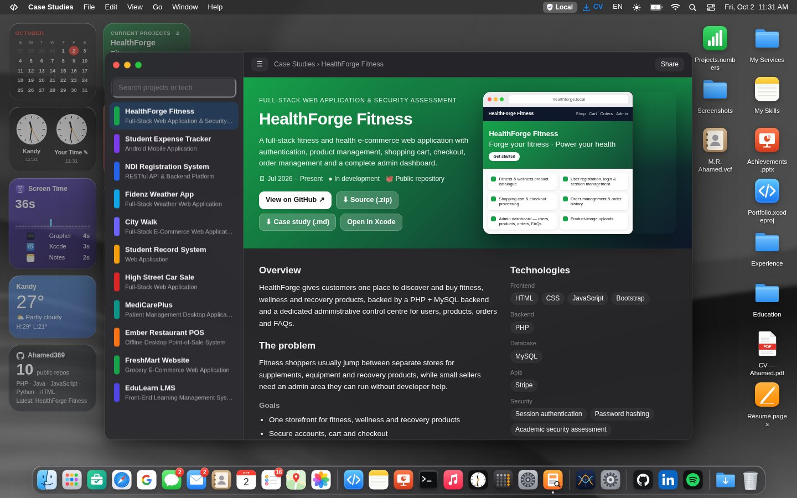

</div>

Case studies provide deeper project explanations including:

`Problem` → `Goals` → `Role` → `Process` → `Challenges` → `Solutions` → `Outcomes` → `Next Steps`

---

# 📝 Skills

<div align="center">


</div>

---

# 💼 Experience

<div align="center">


</div>

---

# 🏆 Achievements

<div align="center">


</div>

The portfolio contains professional achievements plus hidden/exploration and Game Center achievements.

---

# 🛠️ Services

<div align="center">


</div>

---

# 🌙 Dark Mode

<div align="center">


</div>

---

# 📊 Grapher

<div align="center">


</div>

---

# 🔐 Real Features vs OS-Inspired Simulation

The portfolio deliberately separates browser-backed functionality from operating-system-inspired simulation.

## ✅ Browser-Backed Functionality

- 🌦️ Live weather requests
- 📁 Local file import
- 💾 IndexedDB persistence
- ⚙️ Local settings
- 🎵 Media playback
- 📤 Web Share where supported
- 🔔 Browser notifications with permission
- 📷 Camera access with permission
- 🎤 Speech recognition where supported
- 📦 PWA/service worker
- 📺 Picture in Picture where supported
- 🔗 Real external links

## 🎭 OS-Inspired Simulation

- Wi-Fi UI does not change the visitor's actual Wi-Fi
- Bluetooth UI does not control real Bluetooth hardware
- Display settings do not change the physical monitor
- Trackpad controls do not alter hardware settings
- Mobile keyboard settings do not change the real phone keyboard
- FaceTime-inspired interfaces do not pretend to make native FaceTime calls

This keeps the portfolio technically impressive **without making false hardware claims**.

---

# 🧪 Run Locally

## 1. Clone

```bash
git clone https://github.com/Ahamed369/M.R.Ahamed-Portfolio.git
```

## 2. Enter the project

```bash
cd M.R.Ahamed-Portfolio
```

## 3. Install dependencies

```bash
npm install
```

## 4. Start development

```bash
npm run dev
```

---

# 🏗️ Production Build

```bash
npm run build
```

Then preview:

```bash
npm run preview
```

---

# 📜 Commands

| Command | Purpose |
|---|---|
| `npm run dev` | Development server |
| `npm run build` | TypeScript + production build |
| `npm run preview` | Preview production build |
| `npm run lint` | ESLint |
| `npm run typecheck` | TypeScript validation |

---

# 🚀 Deployment

<div align="center">

[](https://m-r-ahamed-portfolio.vercel.app/)
[](https://m-r-ahamed-portfolio.vercel.app/)
[](https://github.com/Ahamed369/M.R.Ahamed-Portfolio/tree/main)

<br>


<br>

### [🚀 OPEN LIVE PORTFOLIO](https://m-r-ahamed-portfolio.vercel.app/)

</div>

---

# 🖼️ Visual Gallery

<details open>
<summary><b>💻 Mac Desktop</b></summary>
<br>
<p align="center">

</p>
</details>

<details>
<summary><b>🚀 Launchpad</b></summary>
<br>
<p align="center">

</p>
</details>

<details>
<summary><b>🔎 Spotlight</b></summary>
<br>
<p align="center">

</p>
</details>

<details>
<summary><b>🎛️ Mac Control Center</b></summary>
<br>
<p align="center">

</p>
</details>

<details>
<summary><b>🔔 Mac Notification Center</b></summary>
<br>
<p align="center">

</p>
</details>

<details>
<summary><b>🪟 Mission Control</b></summary>
<br>
<p align="center">

</p>
</details>

<details>
<summary><b>🧩 Mac Widgets</b></summary>
<br>
<p align="center">

</p>
</details>

<details>
<summary><b>📱 iPhone Home</b></summary>
<br>
<p align="center">

</p>
</details>

<details>
<summary><b>🔒 iPhone Lock Screen</b></summary>
<br>
<p align="center">

</p>
</details>

<details>
<summary><b>🏝️ Dynamic Island</b></summary>
<br>
<p align="center">

</p>
</details>

<details>
<summary><b>🎛️ iPhone Control Centre</b></summary>
<br>
<p align="center">

</p>
</details>

<details>
<summary><b>🔔 iPhone Notification Centre</b></summary>
<br>
<p align="center">

</p>
</details>

<details>
<summary><b>🔄 iPhone App Switcher</b></summary>
<br>
<p align="center">

</p>
</details>

<details>
<summary><b>🖥️ iPad Home</b></summary>
<br>
<p align="center">

</p>
</details>

<details>
<summary><b>🎛️ iPad Control Centre</b></summary>
<br>
<p align="center">

</p>
</details>

<details>
<summary><b>🔄 iPad App Switcher</b></summary>
<br>
<p align="center">

</p>
</details>

<details>
<summary><b>🧑‍💻 Projects</b></summary>
<br>
<p align="center">

</p>
</details>

<details>
<summary><b>📚 Case Studies</b></summary>
<br>
<p align="center">

</p>
</details>

<details>
<summary><b>📝 Skills</b></summary>
<br>
<p align="center">

</p>
</details>

<details>
<summary><b>💼 Experience</b></summary>
<br>
<p align="center">

</p>
</details>

<details>
<summary><b>🛠️ Services</b></summary>
<br>
<p align="center">

</p>
</details>

<details>
<summary><b>🏆 Achievements</b></summary>
<br>
<p align="center">

</p>
</details>

<details>
<summary><b>🌙 Dark Mode</b></summary>
<br>
<p align="center">

</p>
</details>

---

# 🌐 Browser Support

<div align="center">


</div>

Advanced browser features depend on browser support and permissions.

---

# 🗺️ Portfolio Evolution

```text
v7
│
▼
Expanded Applications + Game Center
│
▼
v8
│
▼
Notifications + Window Systems + PWA
│
▼
v9
│
▼
Services + Settings + Utilities
│
▼
v10
│
▼
My Files + Multi-Device System
│
▼
v10.2
│
▼
Dynamic Island + Control Centre + Device Rebuild
│
▼
v10.3
│
▼
Guidebook + Widgets + Music + Learning
```

---

# 🧭 Continuous Improvement

Future refinements can focus on:

- ⚡ Bundle-size optimization
- 🧪 More automated testing
- ♿ Expanded accessibility testing
- 📚 Additional case studies
- 📊 Performance profiling
- 🌐 Browser compatibility
- 🔒 Security refinement
- 🚀 Further performance improvements

---

# ⚠️ Project Notice

This is an independent **web-based personal portfolio inspired by familiar desktop and mobile operating-system interaction patterns**.

It is **not macOS, iOS or iPadOS** and is not affiliated with, sponsored by or endorsed by Apple Inc.

Apple and other third-party names, marks, products and services remain the property of their respective owners.

---

# 👨‍💻 About M.R.Ahamed

<div align="center">

## M.R.Ahamed


<br>

📍 **Kandy, Sri Lanka**

<br>

[](https://github.com/Ahamed369)

[](https://www.linkedin.com/in/mr-ahamed-6146a5276)

[](mailto:ahamedrock369@gmail.com)

<br>

[](https://m-r-ahamed-portfolio.vercel.app/)

[](https://github.com/Ahamed369/M.R.Ahamed-Portfolio)

<br><br>


<br><br>

### ✨ Think Different. Build Different.

**Designed & Developed by M.R.Ahamed**

`React 19` · `TypeScript 5.8` · `Vite 6` · `Vercel`

**© 2026 M.R.Ahamed**

</div>
